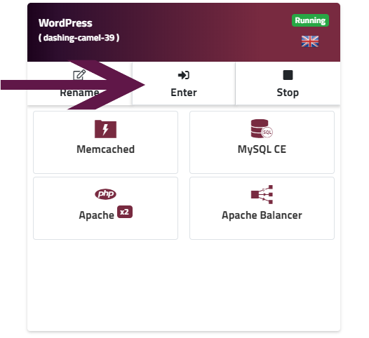
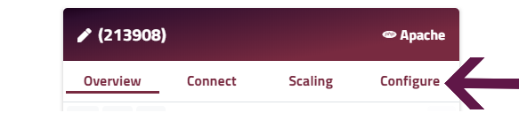
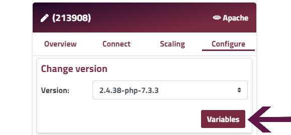

By using variables you can avoid having to include sensitive information in your code, upload them to version control and so on where they could be more easily accessed.

A variable can be anything from a configuration setting, encryption key, external resource addresses, user credentials etc which you can in turn referenced in your script or application by using the variable name. When your script/app is running it will take the variable name and search your variables for the corresponding value which is only stored on your environment node(s).

You can add your variables to any node you prefer and the changes will automatically be applied to all nodes of the same type.

### Adding variables

##### Step 1
Enter your environment.

##### Step 2
Got to the **Configure** tab of the node to which variables should be added.

!!! Variables are saved to all nodes in the same layer so don't worry if you have multiple nodes of the same type in your environment.

##### Step 3
Click on **Variables**.

##### Step 4
Click **Add new variable**

##### Step 5
Enter the environment variable name and value and click **Add** (repeat as necessary to add all the required variables).

!!! The name of your environment variable needs to start with a letter and must contain only letters, numbers and underscores.

##### Step 6
The variables you newly add will appear on the top of the list temporarily. Once you added all the variables you need, click **Save changes**.

!!! The nodes will be restarted to apply the changes.

### Existing variables

Every node you have will have a set of variables pre-defined, however, these are informational only While you may edit these variables to keep the information up to date, the changes you make to these informational variables will not actually change configuration. For example changing MASTER_IP variable will not change the actual IP address of your node. Each node type has a different set of pre-defined variables (mostly informational). To check the list of variables and their function, you can refer to the articles linked below.

[Ruby Apache](/ruby/ruby-environment-variables#ruby-apache-environment-variables)

[Ruby Nginx](/ruby/ruby-environment-variables#ruby-nginx-environment-variables)

