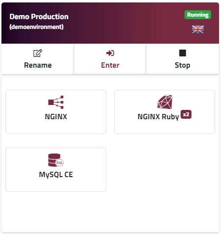

The main dashboard screen is your primary control centre for your Ruby hosting PaaS. You get a good birdseye view of your environments, their state (running, stopped), and their composition (which nodes are inside). Let's walk through the main features of this screen:

##### Balance and payment options
You can always see at a glance how much funds you have remaining in your Enscale account right in the main header. You can use the **Manage payments** button to [top up](/account-and-billing/payments/refill-your-balance), set [auto-refill](/account-and-billing/payments/automatic-refills) or [change the payment methods](/account-and-billing/payments/updating-payment-method) you have on file.

##### Account information
You can access your account information easily by clicking on your email address in the top right-hand corner. From here, you can manage SSH keys for your account, change your account password as well as your gravatar image, see billing related information etc.

##### Support options

In the **Help** dropdown menu you can find a link both to our documentation, as well as open a ticket with our technical support team. Of course you can also use the **Community Forum** to ask your peers.

##### Account collaborators

Within the header, you can see and manage your [account collaborators](/features/collaboration): colleagues that you have granted dashboard access to for one or more of your environments.

##### Create environments

The **Add new environment** box at the start of your environments list will open the **New environment** wizard. Select a location, name your environment (we auto-generate a suggestion for you), and select the node type required by your application from their respective dropdown menus.

Click **Create** when you're finished, and the new environment will be created and added to your list of environments within a few minutes.

Detailed steps and additional explanations can be found [here](/getting-started/create-environment).

##### The environment list
In your main dashboard you can see an overview of your environments and any other environments shared with you by other users. If you have many environments in that list, you might find it convenient to sort environments to see the more relevant ones first in the top-right of the main dashboard view.

​

##### Environment information
You can see the following "at a glance" for each environment:

* Alias: Demo Production
* Name: demoenvironment
* Region: Manchester, UK
* State (running / stopped): Running
* Nodes (number and types): 
  * 1 Nginx load balancer
  * 2 Nginx runtime nodes
  * 1 MySQL CE database node

​

​

##### Start/Stop environment
The **stop/start** button at the top right of each environment gives you easy access to control the most fundamental thing - is your environment running or not.

##### Set environment alias
The environment alias allows you to set a "human friendly" name to more easily distinguish between your environments. Set or edit the alias name using the **Rename** button.

##### Environments shared with you
Environments that are owned by other users and shared with you are listed separately from your own, each within their own section organised by environment owner.

 
