Entering an environment via its button on the dashboard home screen opens the environment view. Here you can see the environment and its nodes in more detail.

### Overview
The environment name is shown prominently at the top. To the right you have the option to stop the environment (if currently running), or start the environment (if currently stopped).
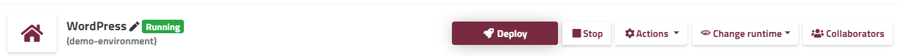

##### Environment Collaborators
This menu shows the collaborators who can access this specific environment from their dashboard. Click the **Collaborators** icon to grant access to additional collaborators, revoke access, or change their permission levels.

##### Change runtime language version
You can change the language version of your application runtime node(s) in just a few clicks. The current version is shown in the menu bar; click it to open the list of available versions for your runtime. Click any available version to make it active. 

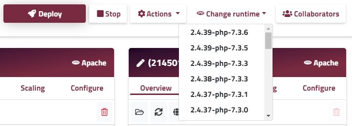

! Your runtime nodes will be restarted to activate the new version.

##### Actions
The actions menu provides details for how to add a custom domain name to your environment, add an SSL certificate, check the audit log. Aldo from here you can clone or delete your environment or even transfer it to another user.
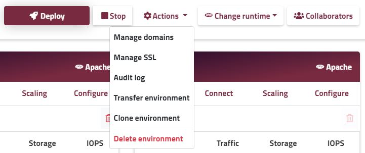
 
##### Deployment
Enscale provides several ways to to deploy your application, available from the Deployment manager. Click on **Deploy** to open it.

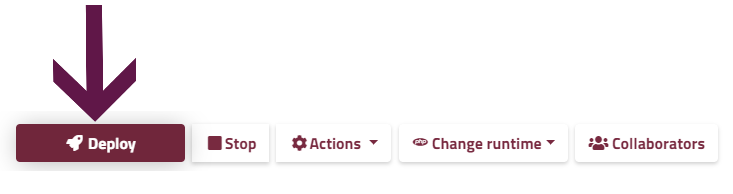
The following articles describe the deployment options applicable for each supported application runtime language:

| |Language |Specific |Articles | |
|:---:|:---:|:---:|:---:|:---:|
||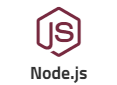|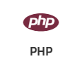|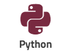|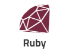|
|[Java deployment guides](/java/deployment-guides)|[Node.js deployment guides](/nodejs/deployment-guides)|[PHP deployment guides](/php/deployment%20guides)|[Python deployment guides](/python/deployment-guides)|[Ruby deployment guides](/ruby/deployment-guides)|

### Node specific information
The environment view provides additional information about each of your nodes.
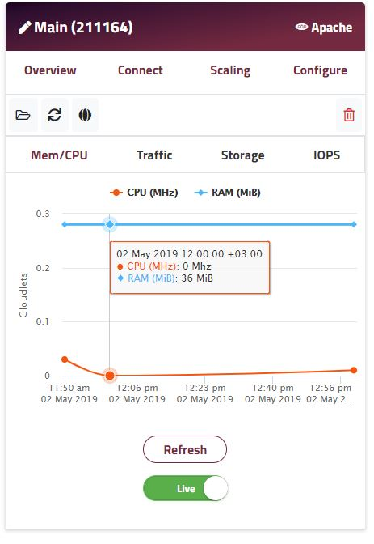

##### Node ID and type
From the image above we can see the following information from the header: 

* Alias: Main
* Node ID: 211164
* Type: PHP - Apache node

##### Overview tab
In the overview tab gives fast access to the most commonly used actions. The lower section contains resource usage statistics.

##### File manager and actions
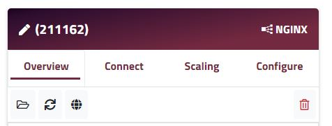 

In the overview tab you will also find the following buttons, from left to right:

**[File Manager](/features/file-manager)**: browser based access to the node's file system including log file access.

**Restart node**: restart this individual node (e.g. to activate a configuration change)

**Open in browser**: direct URL to access this specific node via HTTP

**Delete**: delete this node.

 
##### Statistics

View your Memory and CPU usage, Traffic activity, and Storage used / free. The graphs provide a toggle between live statistics and historical data. Hover over the graph to see exact values. Highlight to zoom.

##### Connect tab
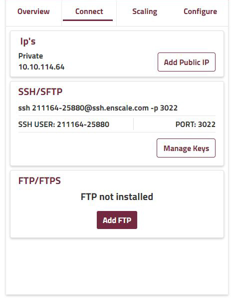

**IP address **

Add (or view) a public IP address to the node. View the node’s private IP address. [Learn more about Enscale IP addresses](/features/ip-addresses).

**SSH/SFTP**

[SSH](/access/access-via-ssh) and [SFTP](access/access-via-sftp) connection details for direct connection to the node. The connect button will launch your SSH client (if ssh:// handler is registered in your OS). The manage SSH keys button provides a shortcut to your [SSH key management](/access/add-ssh-key) area.

SSH keys must be managed separately per Enscale dashboard user; collaborators access nodes via their own keys managed from their own Enscale dashboard.

**FTP/FTPS**

Add the optional FTP feature to the node to activate [FTP / FTPS functionality](/access/ftpftps). Once installed you login details are sent via email, this area updates to contain the FTP connection string, password reset, and the option to remove the FTP feature.

FTP is activated / deactivated for all nodes of the same type in your environment simultaneously.

! FTP connection requires a public IP on the node.

##### Scaling tab
Here you can set the resource limits used to scale your application [vertically](/features/vertical-scaling). Below that you can configure automatic [horizontal scaling](/features/horizontal-scaling) triggers to add and remove nodes when resource usage reaches certain thresholds.
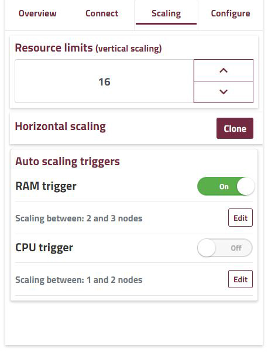

##### Configure tab

In the configure tab you will find the current version of your specific node and are able to change it for that specific node only. Additonally for database nodes you will find connection details and admin panel access under this tab.
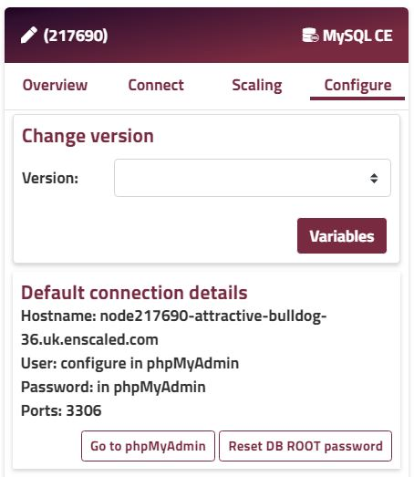
Use the **Variables** button to set [environment variables](/features/environment-variables) for the node that you can reference in your application code.