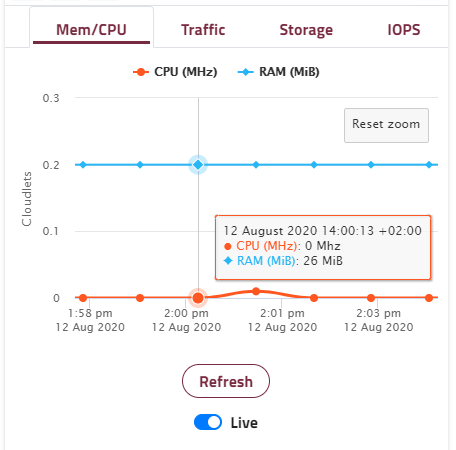

Entering an environment via its button on the dashboard home screen opens the environment view. Here you can see the environment and its nodes in more detail.

### Overview
The environment name is shown prominently at the top. To the right you have the option to stop the environment (if currently running), or start the environment (if currently stopped).

##### Actions
The actions menu provides details for how to [add a custom domain name](/features/add-domain-name) to your environment, [add an SSL certificate](/features/ssl-certificates), check the [audit log](/troubleshooting/log-files/audit-log). Also from here you can clone or delete your environment or even transfer it to another user.

 
##### Deployment
Enscale provides several ways to to deploy your application, available from the Deployment manager, available by clicking on **Deploy**. Detailed articles on the available deployment types are available [here](/deployments).

### Node specific information
The environment view shows additional information about each of your nodes.

##### Node ID and type
From the image above we can see the following information from the header: 

* Alias: Balancer (Give an alias by clicking the **Edit** icon next to the node ID)
* Node ID: 227027
* Type: Nginx

##### Overview tab
The overview tab gives fast access to the most commonly used actions as well as show you live or historical usage graphs for the node.

##### File manager and actions

**[File Manager](/features/file-manager)**: browser based access to the node's file system including log file access.

**Restart node**: restart this individual node (e.g. to activate a configuration change)

**Open in browser**: direct URL to access this specific node

**Delete**: delete this node.

 
##### Statistics

View your Memory and CPU usage, Traffic activity, IOPS, and Storage used / free. The graphs provide a toggle between live statistics and historical data. Hover over the graph to see exact values. Highlight to zoom.

##### Connect tab

**IP address **

Here you can view the node’s private IP address as well as add a public IP. [Learn more about Enscale IP addresses](/features/ip-addresses).

**SSH/SFTP**

[SSH](/access/access-via-ssh) and [SFTP](/access/access-via-sftp) connection details for direct connection to the node. The connect button will launch your SSH client (for Linux and Mac users). The manage SSH keys button provides a shortcut to your [SSH key management](/access/add-ssh-key) area.

SSH keys must be managed separately per Enscale dashboard user; collaborators access nodes via their own keys managed from their own Enscale dashboard.

**FTP/FTPS**

Add the optional FTP feature to the node to activate [FTP / FTPS functionality](/access/ftpftps). Once installed you login details are sent via email, this area updates to contain the FTP connection string, password reset, and the option to remove the FTP feature.

FTP is activated / deactivated for all nodes of the same type in your environment simultaneously.

! FTP connection requires a public IP on the node.

##### Scaling tab
Here you can set the resource limits used to scale your application [vertically](/features/vertical-scaling). Below that you can configure automatic [horizontal scaling](/features/horizontal-scaling) triggers to add and remove nodes when resource usage reaches certain thresholds.

##### Configure tab

In the configure tab you will find the current version of your specific node and are able to change it for that specific node only. Use the **Variables** button to set [environment variables](/features/environment-variables) for the node that you can reference in your application code. Additonally for database nodes you will find connection details and admin panel access under this tab.

