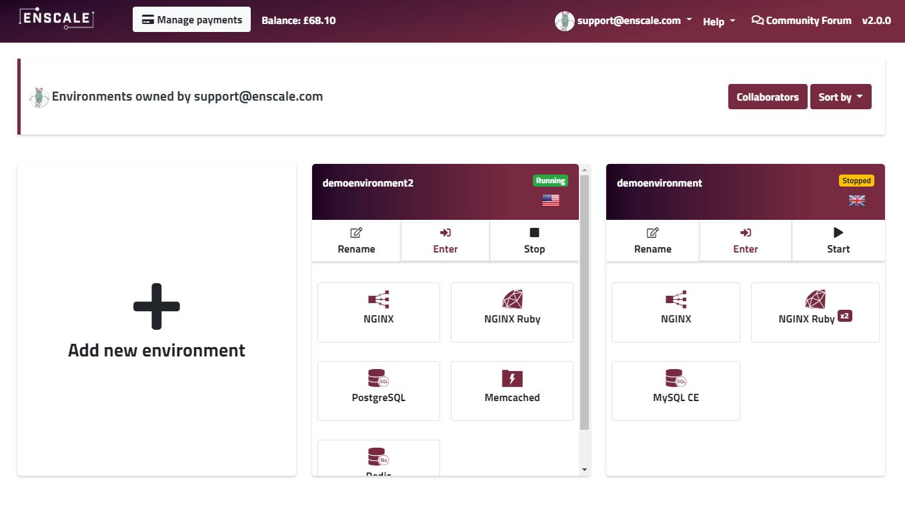
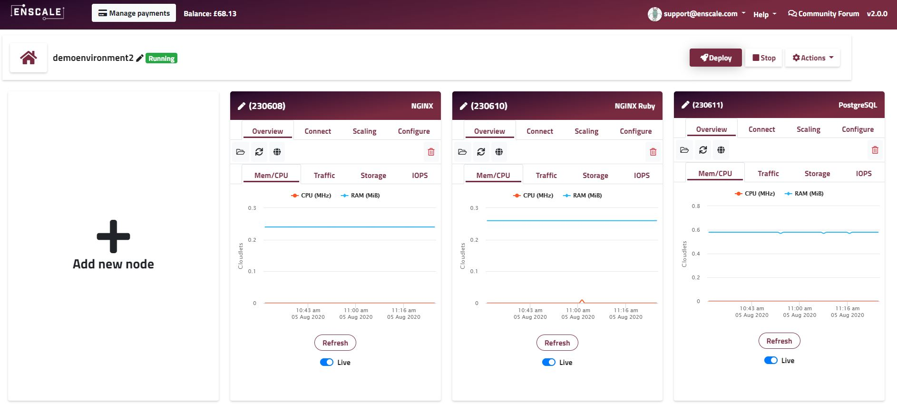

### Overview

The dashboard is organised into 2 main screens:

When you first log in, you are presented with the **main dashboard**; this lists the various Enscale environments that you have access to (yours and your colleagues'), and is also where you can create new environments. 

Each environment has an Enter button, which leads you to the **environment view** screen for the selected environment. 

The environment view provides detailed information about the various nodes within the environment, deploy your code (if the environment contains a runtime node), and add new nodes. 

Read on for more details about the various options and information presented on each screen.

[Main Dashboard](/getting-started/dashboard-guide/main-dashboard) 

[Environment view](/getting-started/dashboard-guide/environment-view)
