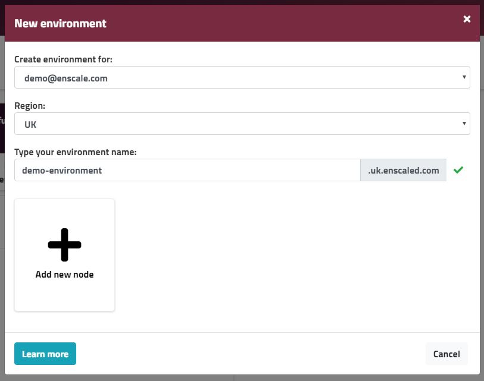

An environment is a logical group of nodes working together to server your application. 

##### Step 1 - Open the environment creation wizzard

Click the **Add new environment** box.

##### Step 2 - Set the basics for your environment

**Create envrionment for** - this specifies the owner of the environment (if you are a [collaborator](/features/collaboration) on other accounts and you have admin permissions for them, you can create environments for those Enscale users)

**Region** - select the location for your server(s). At the moment only UK location is available, keep an eye for announcements for other locations though.

**Type your environment name** - enter a name for your environment. This will form part of the URL to access your application and servers.

##### Step 3 - Select the server(s) to form your environment

Click on **Add new node** and select the type of node you want to add first.

**Load balancer** - A load balancer server comes in handy when you have multiple runtime nodes - it will be set to automatically distribute requests between your servers.

**Runtime** - This is the server that forms the base of your deployments, in essence consider it as the "home" of your application. Runtime nodes are pre-configured with your option of language pack and version. While the version can be changed later on, the selected language is permament.

**SQL Database** - A server running your preferred SQL database.

**NoSQL Database** - A server running your preferred NoSQL database.

**Cache** - Adding a cache node to your environments provides a single larger memory pool to be used by all your servers within the environment for storing and retrieving data.

For each node type you select further options will be available, just keep selecting your preferred option down to the version and you will see the selection added in the blank space.

Let's see take for Runtime as an example. After you select runtime, you are presented with the language options:

Once you select your preferred language, you will be asked to select between various versions:

For PHP for example we offer both Apache and Nginx web servers, so you also need to select which one you prefer:

After making the final selection, the Runtime node shows in your environment creation wizzard like this:

You can repeat the process for up to 8 times (if you need more than eight nodes, you can add more after the environment is created).

##### Step 4 - Create your environment

When all your nodes are selected, click **Create**.The new environment will be created and added to your list of environments within a few minutes. For environments that have multiple nodes, the creation may take a while, you will also receive an email when it's done.

!!! For certain node types you will receive separate emails with access details upon their creation.

