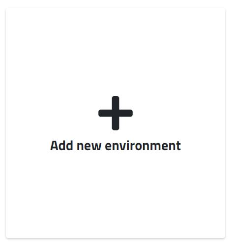
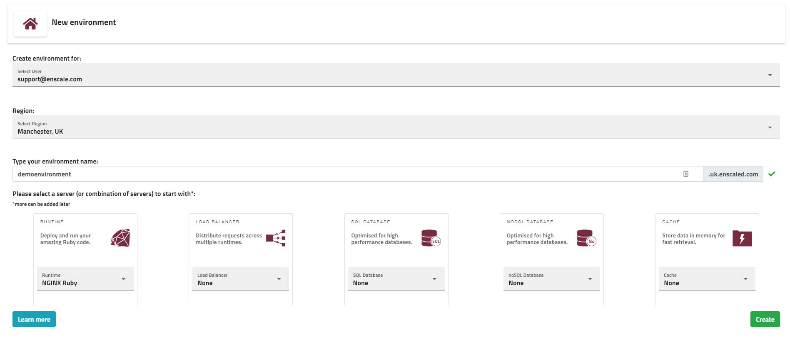
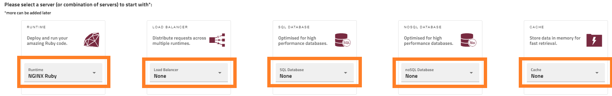

An environment is a logical group of nodes working together to server your application. 

##### Step 1 - Open the environment creation wizzard

Click the **Add new environment** box.

##### Step 2 - Set the basics for your environment

**Create envrionment for** - this specifies the owner of the environment (if you are a [collaborator](/features/collaboration) on other accounts and you have admin permissions for them, you can create environments for those Enscale users)

**Region** - select the location for your server(s). Available locations are Machester (UK), Singapore (SG) and Phoenix (USA).

**Type your environment name** - enter a name for your environment. This will form part of the URL to access your application and servers.

##### Step 3 - Select the server(s) to form your environment

For each server type we offer a variety of options. Select your preferred one using the dropdown menu for each server type.

!!! A runtime is selected by default, but if you need an environment without a runtime node, you can always choose *None* from the dropdown menu.

**Runtime** - This is the server that forms the base of your deployments, in essence consider it as the "home" of your application. Runtime nodes are pre-configured with your option of language pack and version. While the version can be changed later on, the selected language is permament.

**Load balancer** - A load balancer server comes in handy when you have multiple runtime nodes - it will be set to automatically distribute requests between your servers.

**SQL Database** - A server running your preferred SQL database.

**NoSQL Database** - A server running your preferred NoSQL database.

**Cache** - Adding a cache node to your environments provides a single larger memory pool to be used by all your servers within the environment for storing and retrieving data.

!!! The latest available version of each server is added by defaul, but don't worry, you can change it later if required. Multiple servers of the same type can also be added later with [horizontal scaling](/features/horizontal-scaling).

##### Step 4 - Create your environment

When all your nodes are selected, click **Create**. The new environment will be created and added to your list of environments within a few minutes. For environments that have multiple nodes, the creation may take a while, you will also receive an email when it's done.

!!! For certain node types you will receive separate emails with access details upon their creation.

