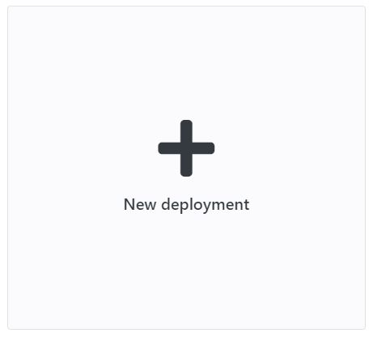

Uploading all your files via FTP can be a tedious process, especially if you have lots of tiny files. With Enscale we made things easy for you, you can deploy directly from an archive. The below method will work for archives up to 150MB, for larger archives, please see here.

##### Step 1

Enter your environment. 

##### Step 2

Click the Deploy button to get to the Deployment manager.

##### Step 3*
!!! \*this step is skipped on very first deployment

Click New deployment.

##### Step 4*
The default setting deploys to the ROOT folder, which corresponds to the default DocumentRoot in the web server configuration. If you would like to deploy to a different location, just specify a directory name (new or existing) in the Deploy to box.

!!! \*depending on your environment ROOT may be the only allowed location, if this is the case the step is skipped.

##### Step 5
This screen presents you with a list of deployed projects, any archive you upload via the dashbaord will be saved and can be selected from here in future.

To add a new archive, click **Deploy a new project**

##### Step 6
Select the **Archive** tab. You can find and upload your archive from your computer by clicking **Browse**, alternatively you can use an upload link in the **Remote URL** tab.

##### Step 7

Once the archive us uploaded, you will be prompted to enter a description for your file - this comment will be attached to your project and will help you identify it in case you want to deploy the same project to several environments.

#### Step 8

Click **Deploy**.

Enscale will unpack your archive so once the deployment process is complete, you should already have your project up and running.

