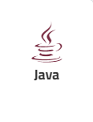
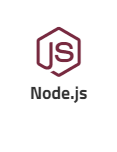
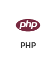
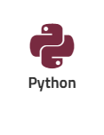
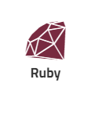

Enscale is all about helping you get your app online quickly, so we tried to make the deployment process as smooth as possible (ideas for improvement are always welcome of course). 

We also offer a variety of deployment methods from the dashboard: 
- you can upload your project archive to deploy your project: [under 150MB](/getting-started/deployments/deploy-from-archive) and [over 150MB](/getting-started/deployments/deploying-archives-150mb)
- [deploy from your git repository](/getting-started/deployments/git) 
- [deploy from SVN](/getting-started/deployments/svn)

Once your application is deployed, you will see it in your Deployment manager, from where you can control any of the deployment settings or do a git pull for example. You can find details about the options in the [Deployment Manager article](/getting-started/deployments/deployment-manager).

Depending on the application language, there are different deployment options available, so while the articles in this section give you a wide overview of the deployment process, I suggest you take a look at the language-specific articles as well here:

| | | | | |
|---|---|---|---|---|
||||||
|[Java deployment guides](/java/deployment-guides)|[Node.js deployment guides](/nodejs/deployment-guides)|[PHP deployment guides](/php/deployment%20guides)|[Python deployment guides](/python/deployment-guides)|[Ruby deployment guides](/ruby/deployment-guides)|
