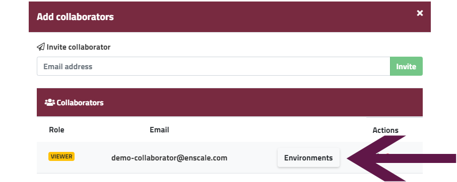
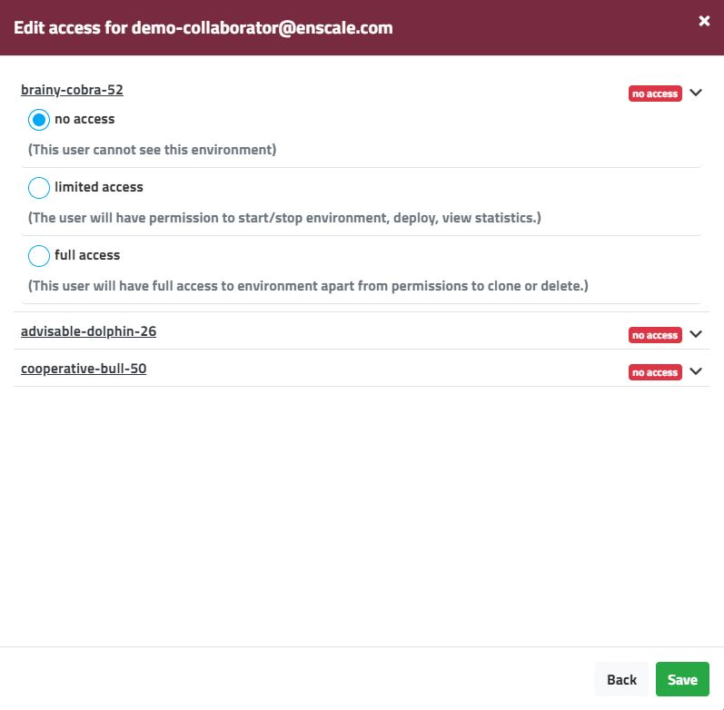
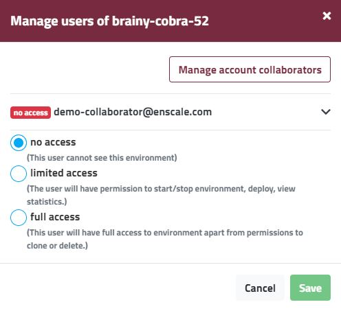

With the collaboration feature in Enscale, multiple users can work on the same environments while having separate logins and access to the Enscale dashboard. There is no limit on the number of environments (or people) you can collaborate with.

##### Step 1 - Sending the invitation

To invite someone to collaborate on your account, simply click the **Collaborator** button on your main dashboard, enter their email address and click **Invite**.

The invitation is sent via email and contains a link to accept the collaboration. Clicking on the link sends the user to a page to set their Enscale password. Once this is done, their account is created and the collaboration status is established. You will receive an email notification immediately and can log in to the dashboard to share environments.

##### Step 2 - Setting the account permissions

On the account level a collaborator can either be viewer or admin. This permission defines whether the user is allowed to create environments on your behalf or not. By default all collaborators are added as viewers. To change this setting, click on the arrow to expand the dropdown. Select the desired permission to set it and click **Save**.

##### Step 3 - Sharing environments

Your collaborators will have access to their own Enscale dashboard, so they will only see the environments that you share with them (or they create for you).

To share environments with a collaborator, from the **Collaborators** menu click on **Environments** next to the collaborator.

This will open up a list of all your environments. Use the arrow to expand and collapse permissions for any specific environment. You can change permission to multiple environments at the same time, just don't forget to **save** your changes at the end.

!!! If no changes are made to the collaborator's role, just **close** the **Add collaborators** modal when done.

Environment sharing is possible from within the environment too, in this case the **Collaborators** button will open a list of all your collaborators and you can set different permissions for them for the specific environment only.

!!!! Your collaborator will receive an email for each shared environment.

Your collaborator will be able to see the shared environments the same way you do in your dashboard, but under the **Environments owned by ...** header. The **Add new environment** option under this header only appears if they have an **Admin** role on your account.

You will be able to keep track of actions performed by your collaborators by viewing the **[Audit log](/environments/access/log-files#audit-log)**.

### Sharing permissions

To fully understand what your collaborators will be able to do on your account / environments please see the below tables.

##### Permission based on user role (Admin vs Viewer)

|        | Owner | Admin | Viewer |
| ------ | :-------------: |:-----------: |:-----------: |
| **Create environment** (shared account)|||| 
| **Create environment** (own account)|   |||
| **Manage collaborators** ||||

 
​

​

environment creation for own account is only allowed if the user you're collaborating with has a full Enscale account

​

##### Permission based on environment access (No access / Limited access / Full access)

|                                          | Owner      | Full access | Limited access | No access |
|------------------------------------------|:------------:|:-------------:|:----------------:|:-----------:|
| Start environment                        || |    ||
| Stop environment                         || |    ||
| Delete environment                       ||  |     ||
| Clone environment                        ||  |     ||
| Restart environment nodes                || |    ||
| Deploy code: archive (saving own archives only)      || |    ||
| Deploy code: git/svn repo                || |    ||
| FTP/FTPS access                   || |    ||
| SSH/SFTP access            || |     ||
| Adjust cloudlet limits(vertical scaling) || |     ||
| Add/remove servers (nodes) from an environment   || |     ||
| Node password reset emails               || |     ||
| Configure auto horizontal scaling        || |     ||
| Receive horizontal scaling notifications || |     ||
| View horizontal scaling history          || |     ||
| Receive load alert notifications         || |     ||
| Edit server configuration files          || |    ||
| View server logs                         || |    ||
| View server resource usage               || |    ||
| Manage domain binding                    || |    ||
| Manage custom SSL                        || |    ||
