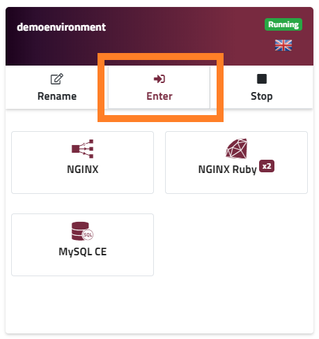
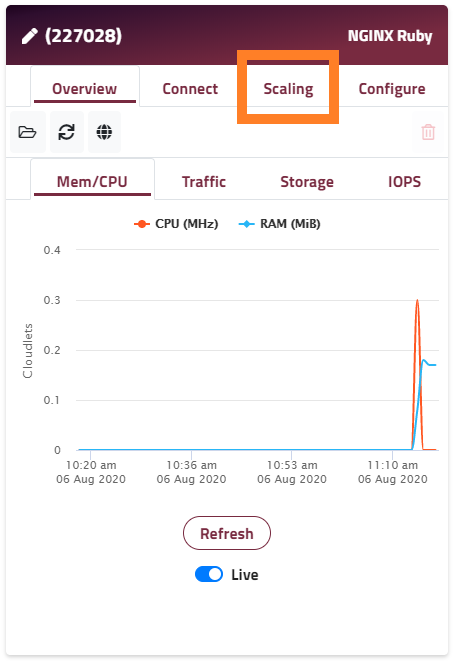
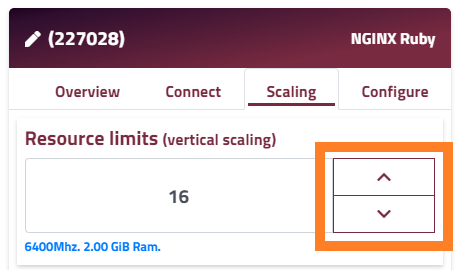
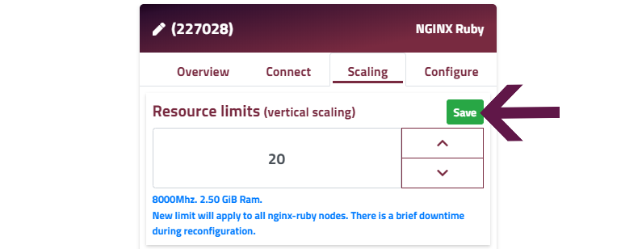

Vertical scaling is the process of adjusting the amount of hardware resources (RAM and CPU) available to a server to cope with varying application demands. For example, add resources to deal with a traffic spike, or remove resources to save money at night.

Unlike [horizontal scaling](/features/horizontal-scaling) (splitting the load across multiple servers), there are no limitations or special requirements for your application code. This makes it the easiest way to scale your application.

Vertical scaling at Enscale is a bit different to what you may be used to elsewhere. Instead of setting triggers to resize your instance at certain times or conditions, you only need to set a maximum instance size (vertical scaling resource limit).

Then, instead of charging based on the instance size, we measure and charge based on the amount of resources your application is actually using each hour. This way you achieve **maximum performance at minimum cost** - automatically. There's no need to guess the perfect instance size up front, and no need to form any complex rules.

This also means you avoid performance lag or downtime typical of vertical scaling operations on other platforms!

We recommend setting a high vertical scaling resource limit, as this gives you maximum flexibility. However, you will receive an email notification if we detect that your application is becoming resource limited by this setting.

The limit is configured independently for each node type within your environment, and can be adjusted whenever you want.

### Set your vertical scaling limits

##### Step 1
Create your environment and enter it.

##### Step 2
Click on the **Scaling** tab on the preferred node.

##### Step 3
Set the desired resource limit by typing a number or using the up and down arrows. Notice that the resources are incremented in steps of 400MHz CPU + 128MiB RAM.

!!! The default resource limit when you're creating your nodes is set based on best practice for the node type. Reducing the limit below this is not recommended as it may cause resource shortages.

##### Step 4
**Save** your changes.

Your server is automatically reconfigured to take full advantage of the available resources upon saving a new resource limit setting. The node's primary service will be restarted to apply the configuration changes, causing a few moments of downtime.

!!The new limit will apply to all nodes that are the same type and there is a brief (few seconds) downtime during reconfiguration.

**Remember, you are only billed based on the resource consumption each hour (not the total limit). Maximum performance, minimum cost.**

