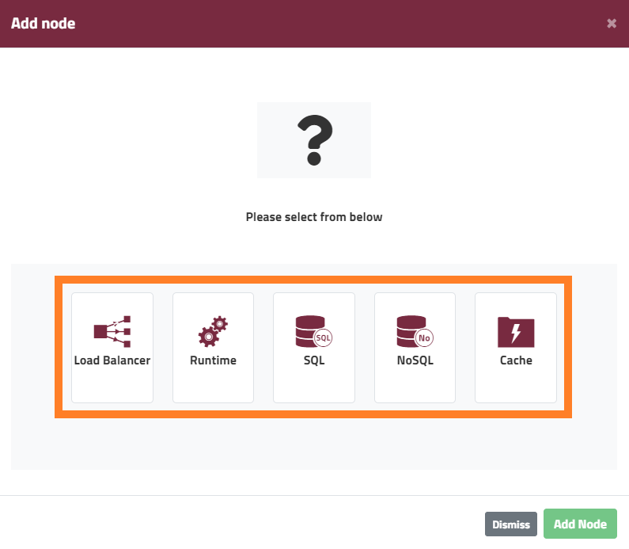
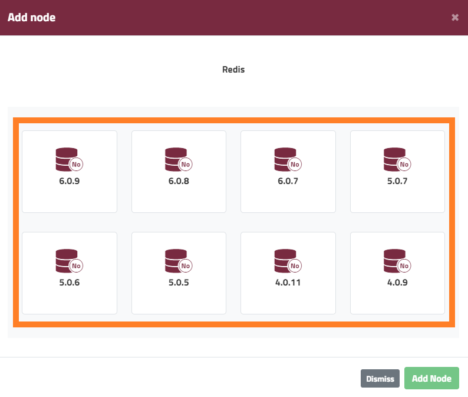
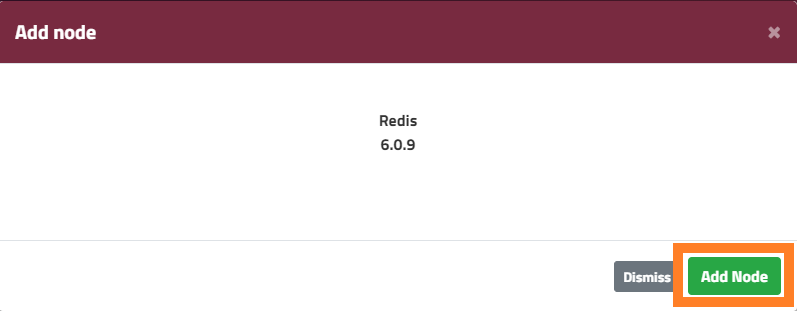
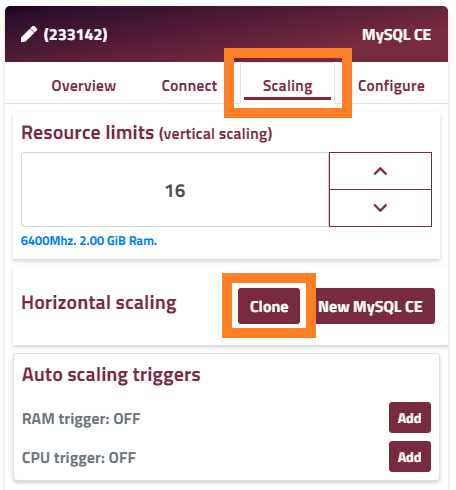
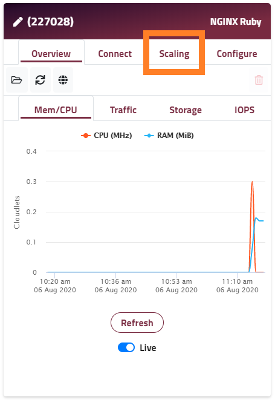
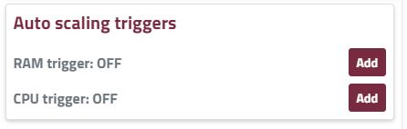
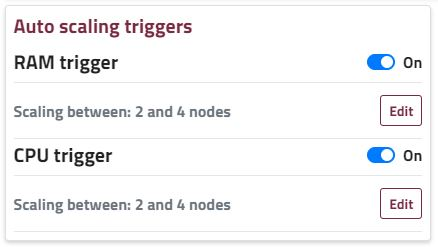

Horizontal scaling is the process of distributing requests across multiple servers to cope with high volume. In theory, the concept can apply to any layer of your application, but in practice it most commonly relates to your application runtime nodes.

Unlike [vertical scaling](/features/vertical-scaling) (increasing RAM and CPU available to one server), you need to take a few steps or precautions regarding your application to ensure it can work smoothly across multiple application runtime nodes.

This can be summarised as ensuring that any asset or resource uploaded, generated, or accessed by your application must be available to all application runtime servers. This includes sessions, user image uploads, and any other data generated by your application.

There are 2 main strategies to achieve this:

* Centralise the data to a specific shared location. E.g. you might use Memcached or Redis as a session storage location. 
* Replicate the data across all servers, so each has its own copy.

The appropriate strategy for your case, and its implementation, is outside the scope of this article, but you are welcome to contact our support team ([support@enscale.com](mailto:support@enscale.com)) for additional guidance on this topic.

Enscale provides the ability to horizontally scale your application [manually](#manual-horizontal-scaling) or [automatically](#automatic-horizontal-scaling). With manual scaling, you can add multiple nodes of the same type or clone existing nodes via the Enscale dashboard. Manual scaling is useful if you expect high loads during a certain period of time and you would like to prepare your application for this in advance.

If your application has irregular spikes, you can set triggers for automatic horizontal scaling to handle these spikes even when you are away from your computer.

When using multiple runtime nodes, you should also add a load balancer to distribute your incoming requests between them. Enscale automatically configures the load balancer to distribute your traffic across your runtime nodes when added, and will automatically add/remove runtime nodes from its configuration as they're added/removed from your environment, or if they're detected as offline.

### Manual horizontal scaling
You can add multiple nodes of the same type right after you've created your environment, and deploy your application simultaneously to all of them at once. Alternatively you can add additional nodes later on, by [cloning](#cloning-existing-nodes) an existing node, in which case all data and configurations of the source node are replicated onto the new one as a point in time snapshot (thereafter the data / configuration is independent for each node).

!!! If you change files in the Enscale [file manager](https://www.enscale.com/docs/10/features/file-manager), you have the option to save the changes to all nodes of the same type.

### Adding new nodes
Adding a new node will always result in an empty node, as such we allow this for non-runtime nodes only (unless the environment doesn't have a runtime node). When using this method, you will always need to make sure new nodes are configured properly after they've been added.

##### Step 1

Click the **Add New Node** button for a selection of available node types. 

##### Step 2 

Select the type of node you would like to add.

##### Step 3 

If you already have a node of that type in your environment, the type version will be the same, else you will need to select the type (if multiple available) and the required version.

##### Step 4

Confirm your selection, by clicking **Add node**.

!!! If you already have a node of that type, and you wish to create a new empty node of the same type, you can also use the **New [node type]** button from the **Scaling** tab.

### Cloning existing nodes

##### Step 1

Enter your environment.

##### Step 2

Go to the **Scaling** tab of your chosen node and click **Clone**.

!! The node you wish to clone will be stopped during the cloning process.

##### Step 3

If cloning a runtime node, you should add at least one load balancer to your environment to distribute requests between the multiple runtime nodes.

### Automatic horizontal scaling

Setting up automatic horizontal scaling with Enscale is really simple. Set CPU or RAM usage triggers via the dashboard, and Enscale will automatically scale your nodes in and out, according to your application’s needs.

You will receive email notifications on each horizontal scaling event, so you can keep track of your environment's evolution.

Automatic horizontal scaling automatically adds a load balancer to your environment when scaling out if a load balancer is not already present. The load balancer is not removed when the number of runtime nodes falls to 1.

!!! To avoid undesirable IP address changes during scaling, it's recommended to always keep a load balancer node (with public IP) in your environment. This will remain a stable endpoint for application requests irrespective of the number of runtime nodes.

Follow the steps below to enable automatic horizontal scaling:

##### Step 1

Create your environment and enter it.

##### Step 2 

Click on the **Scaling tab** on your application node.

##### Step 3 

Select the trigger you would like to set (RAM or CPU) and click **Add**.

!!! For the best results, we recommend defining triggers for both CPU and RAM.

##### Step 4 

Set the minimum and maximum number of nodes you would like to scale between, and the resource usage percentages you would like to trigger horizontal scaling actions at, and **Save**.

**Scale between x and y** - specifies the minimum **x** and the maximum **y** number of runtime nodes for your application. Horizontal scaling will never decrease the number of nodes below the minimum you set here, nor will it increase the number of nodes above the maximum number you set, even if your application is exhausting all available resources.

**Add 1 node when load is above x% and for at least y minutes** - when the global resource usage across all runtime nodes is above **x%** used and remains above that threshold for **y** minutes, an existing node is cloned to add a new one. This continues whenever the combined load remains above the set **x** percentage for an additional **y** minutes, until the maximum number of allowed nodes is reached.

**Remove 1 node when load is below x% for at least y minutes** - when the global resource usage across all runtime nodes drops below **x%** and remains lower than that threshold for **y** minutes, Enscale will destroy 1 runtime node. This continues whenever the combined load stays below the set **x** percentage for an additional **y** minutes, until the minimum number of allowed nodes is reached.

!!! The add and remove node percentages must differ by at least 20%. Optimal scaling results are achieved with a gap of at least 40%, to avoid premature addition or removal of nodes.

##### Step 5 

Once configured, you can turn this feature on and off easily within the dashboard as shown below, while preserving the settings. Click **Edit** if you wish to re-adjust the trigger settings.
