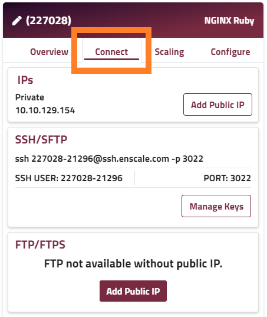
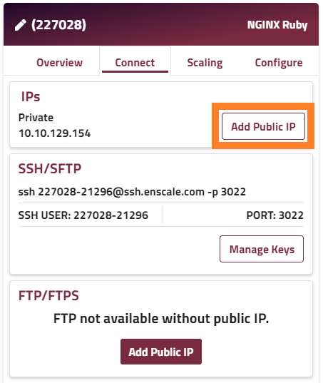
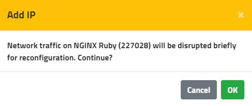

You can choose between using a private (RFC 1918) IP address (default) or a publicly routed IP address on any of the nodes within your Enscale environments. You will normally use a public IP for the externally facing node(s) of your environment (e.g. load balancer if you have one, or application runtime node if not), and private IPs for internal communications between nodes (e.g. application runtime and database servers).

The differences, and how to find and configure IP addresses for your nodes via the Enscale dashboard, are explained below.

### Using a Private IP address

A private IP address is one from the reserved RFC 1918 ranges (10/8, 172.16/12, 192.168/16). Private IP addresses are not routable across the internet. They are useful for internal communications within a network (e.g. between an application and its database server), but cannot be used for your end users to connect to your application.

Private IP addresses are assigned to each of your Enscale nodes by default.

### Externally facing nodes
If your externally facing node (load balancer if you have one, or runtime if not) only has a private IP address, we map your environment name to the public IP addresses of our HTTP Routers.

The HTTP Routers are shared proxy servers, forming part of Enscale's core infrastructure. In a similar way to a NAT gateway, they accept requests on a common public IP, and translate those HTTP requests from the internet to the private addresses of your nodes. This way you can still serve your application to the internet, even without your own dedicated public IP.

##### Limitations:
* HTTP Routers only support standard HTTP or HTTPS traffic on the standard ports (80 / 443) 
* SSL certificate presented for HTTPS traffic only covers the default environment domain 
* HTTP Router performs SSL offloading for HTTPS traffic; requests are passed to your environment as plain HTTP (see [X-Forwarded-Proto header](https://www.geeksforgeeks.org/http-headers-x-forwarded-proto/)) 
* Traffic is rate-limited (bandwidth and concurrent connections) to ensure fair QoS for all customers 
* Undefined public IP for outgoing requests originated from your application (e.g. API requests)

##### Recommended for:

* Test / development environments

##### Not suitable for:

* Production environments 
* Custom SSL certificate 
* Load testing

### Internal / backend nodes

If your internal node (e.g. database server) has an administration panel (e.g. phpMyAdmin), we map the node URL to the public IP addresses of our HTTP Routers. This enables you to use those tools successfully in your browser, without exposing the underlying service (e.g. MySQL) to the internet.

All of your Enscale servers within the same region (including between different environments) can communicate directly via their assigned private IP addresses.

##### Limitations:

* Servers inaccessible from the internet (also a security benefit!), except for applicable administration panel via HTTP Router.

##### Recommended for:

* All internal nodes (anything that does not directly receive requests from the internet).

##### Not suitable for:

* Direct access to backend server from an external location (e.g. mobile app connecting via internet directly to a MongoDB instance).

### Using a Public IP address

A public IP address is a static internet-routable address. It is attached exclusively to your server, and **will not change** (e.g. even if you stop the server or reboot it).

Requests to a public IP address go directly to your node, not via the HTTP Router.

A public IP address can be configured separately for each node within your Enscale environment.

!!! You will be billed for each public IP address on an hourly basis, regardless of environment state (running or stopped).

It's strongly recommended to enable a public IP address for each of your externally facing node(s). This is normally either your load balancer, if you have one, or your application runtime node, if not.

##### Recommended for:

* Externally facing nodes on production environments 
* Direct connection to your internal / backend nodes 
* Use with a custom SSL certificate 
* When you need a stable outbound IP (e.g. remote API whitelisting)

### Steps to enable a Public IP address

##### Step 1

Create your environment and enter it.

##### Step 2

Select the **Connect** tab on your desired node.

##### Step 3

Click **Add Public IP**.

##### Step 4

Click **OK** to confirm that you understand network traffic will be briefly interrupted.

The newly assigned public IP will be shown in the **Connect** tab of your node.

### How will my application be affected?

Adding or removing a public IP address from your node triggers the following steps:

1. The network interface is reconfigured for the node (IP is added or removed)
2. The node's main service is restarted

These steps usually only take a few seconds, so the disruption should be almost undetectable for your end users, but it depends on the exact node type. The table below describes the typical disruption you may experience whilst adding/removing a public IP from each node type.

| Node type | Typical restart time |
| --------- | -------------------- |
| Load balancer | 5 seconds |
| Runtime | 5 seconds |
| Database | 30 seconds |

Times stated are only an approximate guide, restart times vary depending on your particular configuration and application.

If your nodes are horizontally scaled (multiple nodes of the same type) on that layer, you can normally avoid application downtime by restarting one node at a time (i.e. only adding/removing a public IP from one node at once).

! Please ensure that internal calls between your environment nodes (e.g. application and database nodes) are using the private IP address; all traffic routed via the public network (i.e. via public IP) may be chargeable.