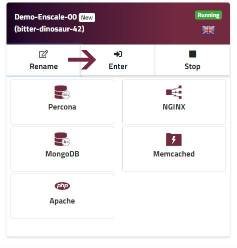
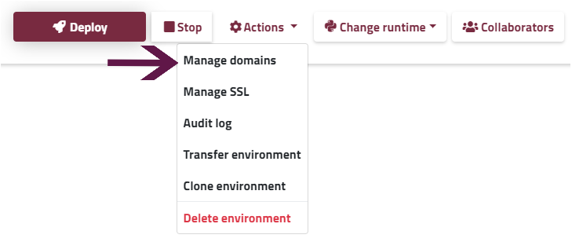
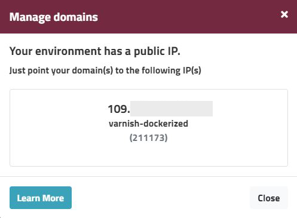
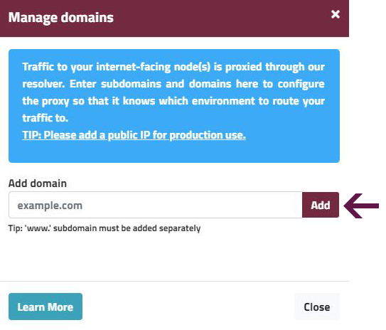
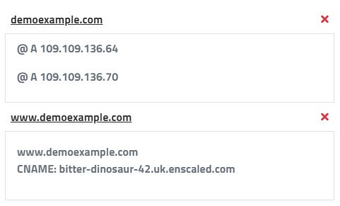

### USE YOUR OWN DOMAIN

With Enscale you have the possibility to add your custom domain name to your environment for quick and easy access whether you have a public IP address enabled or not.

If you have a production environment, we strongly recommend that you enable public IP. To see how to do this, check out the following [article](/features/ip-addresses).

### With Public IP

Once you have a Public IP, here are the steps you need to follow to link your environment to your domain name.

##### Step 1

Enter your environment.


##### Step 2

Go to **Actions** and select **Manage Domains**.


##### Step 3

Create an A record in your DNS zone pointing your domain name to the Public IP address shown.


### Without Public IP

For staging and development environments, you don’t necessarily need to enable a Public IP address, however you can still add your custom domain name.

All you need to do is follow these 4 simple steps:

##### Step 1

Enter your environment.


##### Step 2

Go to **Actions** and select **Manage Domains**.


##### Step 3

Type in your domain name and click **Add**.


!!! ‘www.’ subdomain needs to be added separately.

##### Step 4

Now that you told Enscale what your domain is, you need to adjust the DNS zone of your domain to point it to your environment.

To do this you will need to enter the following DNS records:
```
Domain.com                  A                          IP
Domain.com                  A                          IP
www.domain.com     CNAME                    environment_name.uk.enscaled.com
```
To see the records you need to add, expand the menu by clicking on your domain name.

 