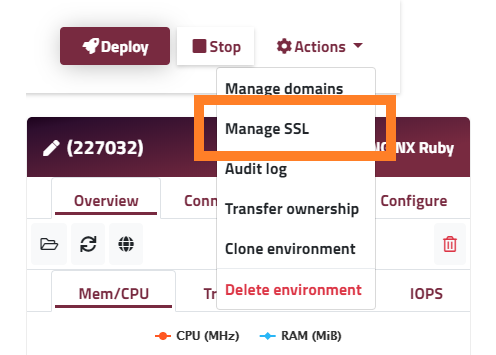
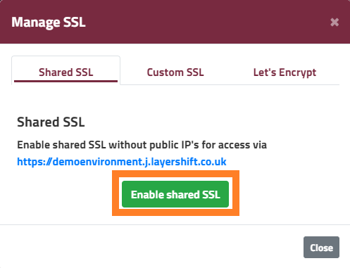
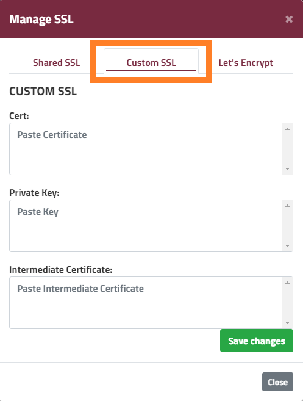
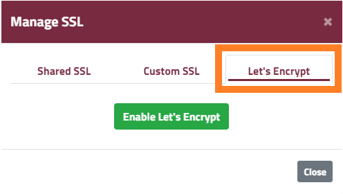
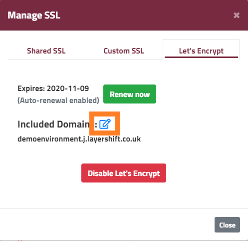
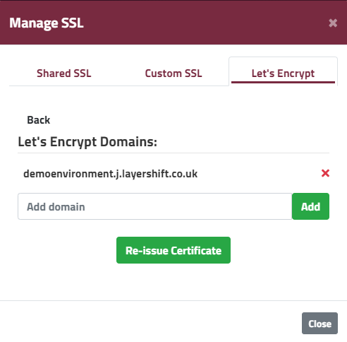

### SSL CERTIFICATE SUPPORT

As the number of hackers, identity thieves and phishing attacks is constantly increasing, it’s very important to keep the information path between you and your customers’ computers safe and private. With Enscale you can make sure you’ve got this covered by enabling the SSL feature. You can choose between the [Shared (free) Enscale SSL](/features/ssl-certificates#enscale-shared-ssl), your own [custom SSL](/features/ssl-certificates#custom-ssl-certificate) certificate or [Let's Encrypt](/features/ssl-certificates#lets-encrypt-ssl-certificate).

Although the Shared SSL is a quick and free solution it’s designed only for testing purposes. For all other cases (e.g. production websites, public demos, anything business critical) we strongly recommend using a Custom SSL or the Let's Encrypt option to ensure your users see your own domain in the URL without Enscale branding. A shared SSL certificate might raise suspicions. If you try forcing your domain name in the secure connection you will end up getting browser warnings, which will only affect your credibility even more.

### Enscale Shared SSL

Shared SSL is intended to be used for start-up projects, staging / development websites or in any other scenarios where the secure connections are not intended to be seen by the public. As its name suggests, this shared SSL is a free certificate provided by Enscale, available for use to all platform users.

Wildcard SSL certificates are installed on our shared load balancers and they will make your environments accessible securely on their respective links only (not custom domain name) ie. https://your-environment-name.sg.enscaled.com

!!! Enscale Shared SSL can only be used for environments without a [public IP](/features/ip-addresses#steps-to-enable-a-public-ip-address).

To enable Shared SSL follow the steps below:

##### Step 1

Log in to Enscale and enter your environment.

##### Step 2

Select **Manage SSL** from the **Actions** drop-down menu.

##### Step 3

Click on **Enable Shared SSL**.

##### Step 4

You can always remove the SSL with the **Disable shared SSL** button.

!!! You may now want to configure redirects to the https version of your environment if you want visitors to only use the secure connection to the site.

### Custom SSL certificate

If you have a production website, we recommend that you use an SSL certificate that was issued specifically for your domain name.

Custom SSL certificates are very popular as they allow you to secure your own branded URL. There are multiple certificate types, depending on the validation process, the number of domains they cover and the level of assurance they provide to customers. Reach out to our [SSL department](mailto:ssl@layershift.com) for more information.

If you already have a Custom SSL certificate for your domain, all you need to do is follow these simple steps to install it:

##### Step 1

Enter your Enscale environment.

##### Step 2

Select **Manage SSL** from the **Actions** drop-down menu.

##### Step 3

Go to the **Custom SSL** tab. Copy and paste your SSL certificate parts in the appropriate sections.

! To be able to install your own custom SSL certificate you will need to add a public IP to the outward facing node of your environment (application server or load balancer). If you don’t have a public IP yet, it will be added automatically during the SSL installation, this will cause a short downtime of the affected nodes.

##### Step 4

Click **Save changes** to save and enable your SSL certificate.

!!! You may now want to configure redirects to https://yourdomain.com so your visitors will only use the secure connection when accessing your website.

##### Step 5

You can edit the existing SSL anytime by opening the **Manage SSL** menu, or delete it by clicking **Remove SSL**.

### Let's Encrypt SSL certificate

Let's Encrypt SSL certificate is available free of charge and can be enabled on environments with a [public IP](/features/ip-addresses#using-a-public-ip-address) address. It can be used to secure both your environment name, nodes and custom domains with a single certificate.

While Let's Encrypt SSLs have a shorter certificate lifetime than custom SSLs you can purchase, in Enscale they are set to renew automatically by default 30 days in advance, so you needen't worry about expiration. Should the automatic renewal fail, you will receive an email and you will have plenty of time to renew the SSL manually.

You can add a Let's Encrypt SSL by following the steps below:

##### Step 1

Log in to Enscale and enter your environment.

##### Step 2

Select **Manage SSL** from the **Actions** drop-down menu.

##### Step 3

Select the **Let's Encrypt** tab and click **Enable Let's Encrypt**

!!! If your environment doesn't have an IP, enabling Let's Encrypt will automatically add one for you. 

##### Step 4

Let's Encrypt is installed by default to secure your environment name. To add your own domain to the certificate, open the Manage SSL section again once Let's Encrypt is installed and click click the **Edit** icon. (Installation takes around five minutes, look out for the success notification and the email to know when it's done).

##### Step 5

Enter your domain name and click **Add** to add it to the list. You can add multiple domain names at the same time (www variant needs to be added separately). 

Domains can be removed by pressing **x**. 

Once your list is complete, click **Re-issue Certificate**.

!!! In order for Let's Encrypt to be able to secure your custom domain, the domain already needs to point to your environment and access needs to be allowed to _root/.well-known_ folder for any domain you wish to include in the SSL.

