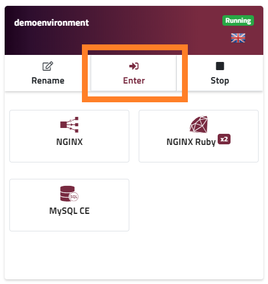
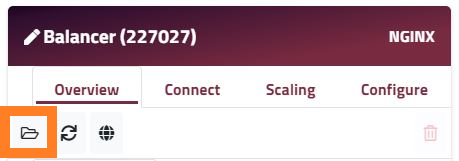
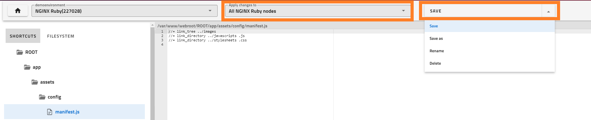
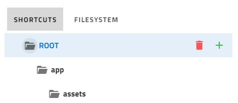

### MANAGE YOUR APPLICATION’S FILES IN THE DASHBOARD

We strongly recommend using **[SSH](/access/access-via-ssh)** and **[SFTP](/access/access-via-sftp)** to make file additions / edits, but sometimes it can be more convenient to make a simple change directly from the comfort of your browser. For example if you're installing Wordpress, you need to rename / edit the _wp-config-sample.php_ to _wp-config.php_ for the application to work.

Enscale makes this very easy:

##### Step 1
Open the [Enscale dashboard](https://dashboard.enscale.com) and enter your environment.

##### Step 2

Each node has its own filesystem. Find the node you wish to work with and click the **Folder** icon to launch the file manager.

##### Step 3

On the left-hand side you will see a file tree. You can chose to see the default shortcuts (folders you are likely to need to access) or the entire file system. Navigate to the folder you need to and open the file by clicking on it.

##### Step 4

From the right-hand dropdown you can select which action you would like to perform to the file - Save, Save as, Rename or Delete. You will also have an option to apply the change to all nodes of the same type, or just the node you are currently in.

You can add a new file or folder by clicking on the **+** icon that appears in the file system when hovering over a file or a folder.

Use the **Delete** icon to remove any files or folders you no longer need.

!!! Certain files and folders are restricted, so you only have view rights to them. In case you need to modify any content for these files, please reach out to our support team for assistance.