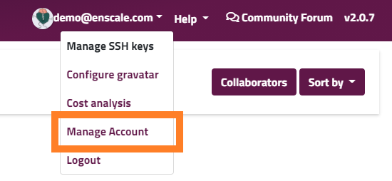

You can access the manage account dashboard from the main dropdown menu, as shown in the image below.

From manage accounts you can see a snapshot of your costs and an estimated period the current balance will last. The weekly cost shown is an esitmate based on your previous week's spending. In case you would like to top up your account, you can click **Add Credit** which will open the [standard refill modal](/payments/refill-your-balance#step-2).

From the left-hand menu you have the options to [change your password](/reset-password#change-password), set up [two-factor authentication](/account-and-billing/twofactor-authentication) for your account, [view your invoices](/payments/invoices) or manage the [auto-refill settings](/payments/automatic-refills) you have.

