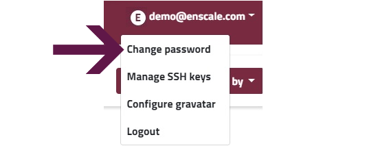
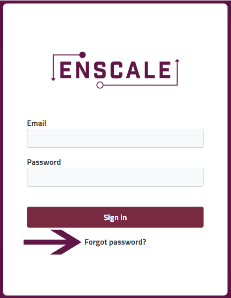
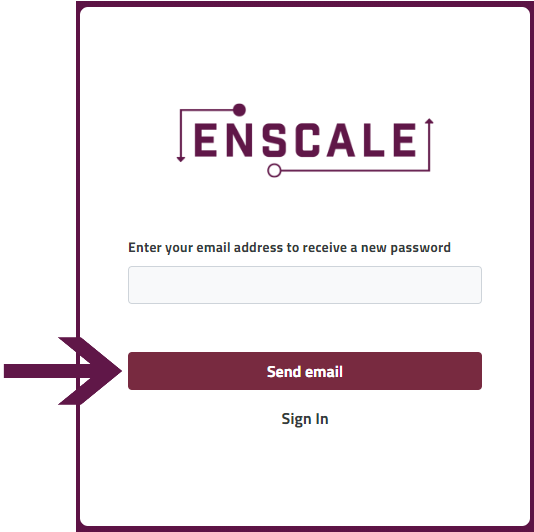

We take security seriously, user passwords are stored encrypted throughout our platform and we will not be able to disclose it to you, nor change it on your behalf. In order to reset your password, you have the following two options:

### Change password

##### Step 1

Click on your email address and select "Change password" from the drop-down menu.

##### Step 2

Enter your current password, your new password and confirm your new password in the corresponding fields then click **Save**.

### Forgot password

##### Step 1

Go to the [Enscale dashboard](https://dashboard.enscale.com) and click on "Forgot password?"

##### Step 2
Enter your email address and click "Send email".

##### Step 3

Check your email for the temporary password (don't forget to check your spam folder). 

! The temporary password expires in 24 hours, follow the steps below to change your password once logged in!

