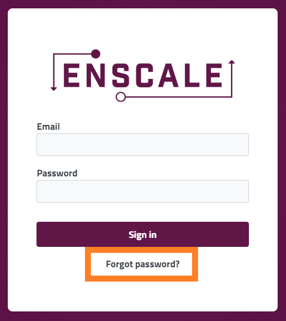

We take security seriously, user passwords are stored encrypted throughout our platform and we will not be able to disclose it to you, nor change it on your behalf. In order to reset your password, you have the following two options:

### Change password

##### Step 1

Click on your email address and select **Manage account** from the drop-down menu.

##### Step 2
Select the **Change Password** option from the navigation menu on the left.

##### Step 3

Enter your current password, your new password and confirm your new password in the corresponding fields then click **Save**.

### Forgot password

##### Step 1

Go to the [Enscale dashboard](https://dashboard.enscale.com) and click on **Forgot password**?

##### Step 2
Enter your email address and click **Send email**.

##### Step 3

Check your inbox for the password reset email and click the reset password link within to take you to a password reset page. Enter your new password and confirmation for it, then press **Confirm Reset**.

!!! The link from the email can only be used once and is valid for 72 hours.