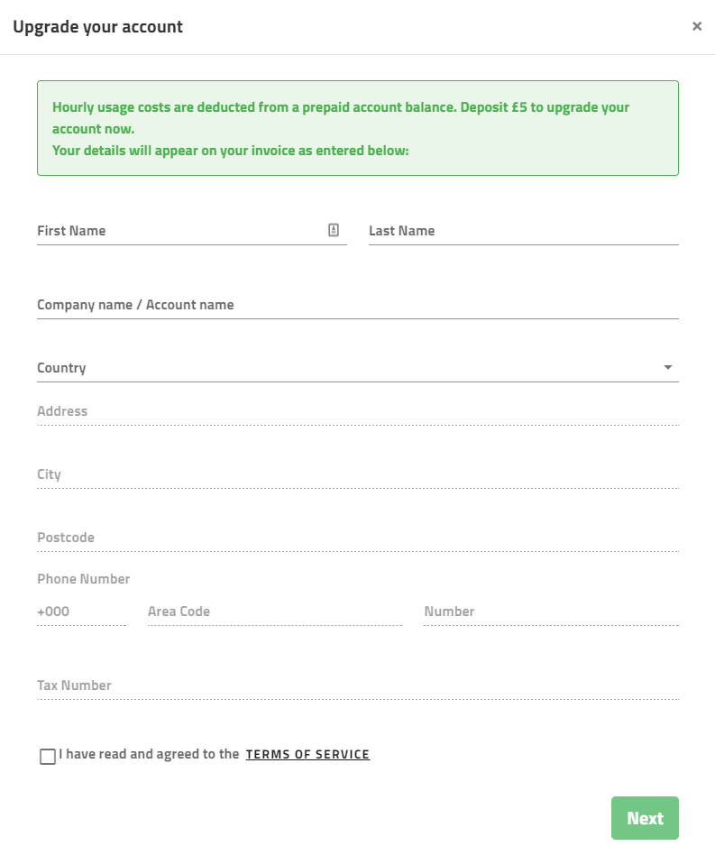
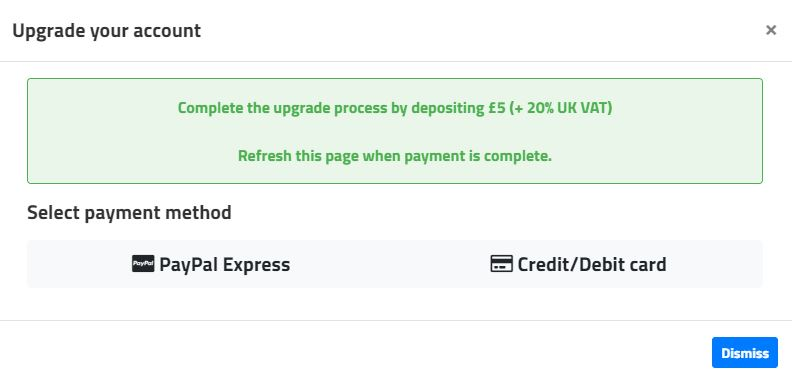
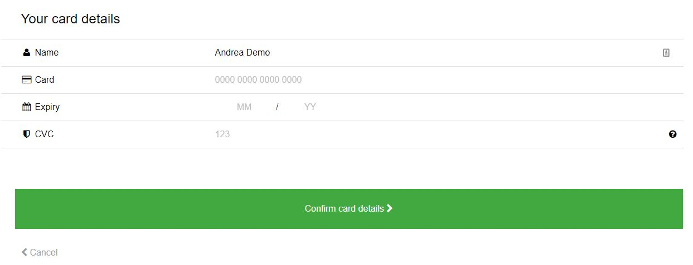
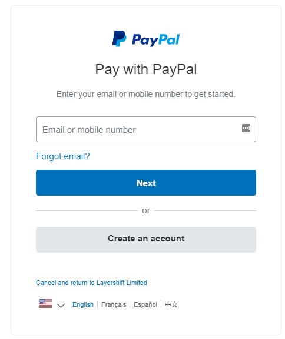

Once you're convinced that Enscale meets your requirements, you can upgrade your account to a full billing account by making a £5 payment.

To upgrade you need to perform the following steps:

1. Click the **Upgrade account** button 

​
​
​
​
​
​
2. You will then need to fill out a form with your account details. Please note that these details will be on invoices you receive. We require the following information:
First and Last name
Company name / Account name* 
Country
Address
City 
Postcode (or ZIP)
Phone number
Tax number (VAT number)**

\*for personal accounts, you can use your name or any desired account name in this field
\** this field is optional

3. Choose your preferred payment method, card or PayPal account.

!!! Your card details are saved in your account so you can enable [automatic refills](/account-and-billing/payments/automatic-refills). PayPal is used for one-time payments only.

4. The payment gateway of your choice will be opened in a new tab - the PayPal login page for a PayPal payment, or the SagePay gateway for card payments. Fill out the details for your 

 