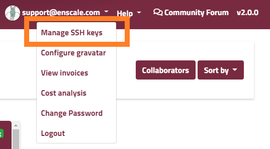
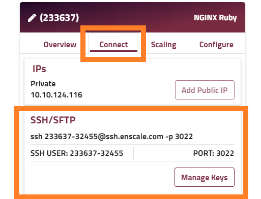
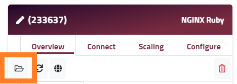
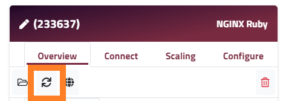

This app was created so you can familiarize yourself with some of the basic Enscale features you are likely to need for your own application. As such, we recommend that you deploy it and go through the guided steps to get a feel for the dashboard and how things work.

Going through the quickstart app takes about 20 minutes (wait-times included), and you'll definitely learn a lot, however shoud this not be enough of incentive, once all the steps are completed, you can claim £20 credit for your Enscale account to prolong your trial period whilst you test your custom application on our platform.

### How to complete the Quickstart app?

The steps provided below are specifically for the demo app, but at the end of each step there's a link to additional documentation about the features used in case you want to find out more about them.

##### Step 1

You need to create an environment, with a single Nginx Ruby node. From the Enscale dashboard, click **Add new environment**, once on the environment screen, click **Create**. For the purposes of the demo the defaults are okay, you may of course change the region or environment name if you prefer.

Learn more about [creating environments](/getting-started/create-environment).

##### Step 2

Now that you have the environment, you need to deploy the Quickstart application. For this enter the environment (**Enter** button on the environment's tile), and click **Deploy**.

The Quickstart app is on GitHub and can be deployed with a single click on **Deploy** (we've prefilled the link and as this is a public application there is no need for any authentincation). 

Learn more about [deployment options](/deployments).
Learn more about [git deployments](/deployments/git).

##### Step 3

The quickstart app is deployed, so you can open it to see what else you can learn about. To open the application you can use the **Open in browser** option from the hamburger menu from your project or if you go back to your environment, you can click on the **Globe** icon on your node. 

Learn more about the [managing your deployments](/deployments/deployment-manager).

##### Step 4

First you're asked to add a redis database node to the environment. This can be done from the Environment's screen by clicking **Add new node**. Select **NoSQL** type and from there click on **Redis**. Next you will need to select the prefered version (any version should do for the purposes of this application).

When the database is added to your environment, you will receive an email with its details, like the access URL and password. You will need these for the next step.

##### Step 5

Add an environment variable with the database URL to your application node. This variable will make the connection between the database and your application more secure as you won't need to use the Redis password in your code.

On your Nginx Ruby node click on the **Configure** tab and click **Variables**. Click **Add new variable** and enter the following:

Name: REDIS_URL
Value: `redis://:[redis_password]@[accessURL]` - for example redis://:IOVrsn82356@node23469-demoapplicationnew.uk.enscaled.com

Click **Add** then **Save changes**.

Learn more about [environment variables](/features/environment-variables).

You've successfully completed the first goal, well done!

##### Step 6

To secure your site with SSL in your environmnet click on **Actions** and select **Manage SSL** from the dropdown menu. In the modal click **Enable shared SSL**.

Go back to your demo application and load it with https:// to complete the second goal (or you can open from the application node by clicking the globe button).

You can read more about the SSL options Enscale offers [here](/features/ssl-certificates). 

##### Step 7

Create a public and private key pair to use for connecting to Enscale via SSH. Steps to create the key pair can be found in [this article](/access/generate-ssh-key) should you need them.

##### Step 8

Access the **Manabe SSH keys** modal from the dropdown and switch to the **Public Keys** tab.


##### Step 9

Use the connection details show to access the SSH gateway - from here you can use the interactive menu to enter the desired environment and node. Or you can connect to your node directly with the connection details on the respective node's connect tab:


##### Step 10

Once you SSHed into your node, run the following command in the application's root directory (/var/www/webroot/ROOT).

`rails secret > config/master.key.example`

##### Step 11

Go back to the demo app in the browser and refresh to complete the third goal.

##### Step 12

From the Enscale dashboard go to your application node and open the **File manager**.


##### Step 13

Use the file tree to open the *database.yml* file.

##### Step 14

Replace the file contents with the below lines and **Save**.
```yaml
default: &default
  adapter: sqlite3
  pool: 5

production:
  <<: *default
  database: yourdbnamehere.db
```

!!! We recommend copying and pasting directly from here or the demo app to ensure the YAML syntax remains valid.

To see what else you can do in the **File Manager**, click [here](/features/file-manager).

##### Step 15

Restart your application node for the configuration changes to take effect.



##### Step 16

Open your application again, or refresh the tab to complete the last goal.

##### Step 17

Congratulations! You've completed our Quickstart app, now all that's left is to claim your reward. Click the **Claim reward** button to receive your reward.

!!!! The bonus is only awarded once per account after all the goals in the application are completed. Play fair. :wink:
