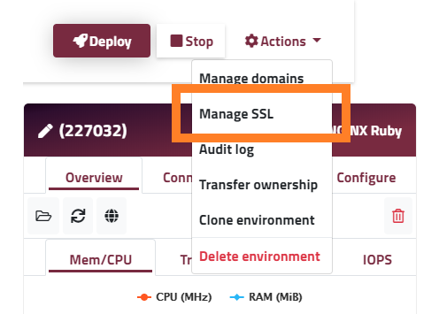

This app was created so you can familiarize yourself with some of the basic Enscale features you are likely to need for your own application. As such, we recommend that you deploy it and go through the guided steps to get a feel for the dashboard and how things work.

Going through the quickstart app takes about 20 minutes (wait-times included), and you'll definitely learn a lot, however shoud this not be enough of incentive, once all the steps are completed, you can claim £20 credit for your Enscale account to prolong your trial period whilst you test your custom application on our platform.

### How to complete the Quickstart app?

The steps provided below are specifically for the Quickstart app, but at the end of each step there's a link to additional documentation about the features used in case you want to find out more about them.

##### Step 1

You need to create an environment, with a single Nginx Ruby node. From the Enscale dashboard, click **Add new environment**. This takes you to the environment creation screen - wait a few seconds for the defaults to load and click **Create**. 

For the purposes of the demo the defaults are okay, you may of course change the region or environment name if you prefer.


Learn more about [creating environments](/getting-started/create-environment).

##### Step 2

Now that you have the environment, you need to deploy the Quickstart application. For this enter the environment (**Enter** button on the environment's tile), and click **Deploy**.


Once on the deployment screen click **Deploy a new project**.


##### Step 2

The Quickstart app is on GitHub and we've prefilled the link in the Git deployment tab in the deployment manager. As this is a public app, no authentication is required and you won't be needing to update it either, so just click **Deploy**.


Read more about [deployment options](/deployments) in general, or [git deployments](/deployments/git) specifically to familiarize yourself further with the possibilities Enscale offers.

##### Step 3

After a few minutes the quickstart app will be deployed, so you can open it to see what else you can learn about. To open the application you can use the **Open in browser** option from your project's dropdown menu.


For a github project the fun doesn't have to end with deployment - learn more about [managing your deployments](/deployments/deployment-manager) to learn how to automatically deploy project updates and more.

##### Step 4

Your first goal is to add a Redis database to your environment.

This can be done from the environment's screen (what you see once you enter your environment) by clicking **Add new node**. 

Select **NoSQL** type and from there click on **Redis**. Next you will need to select the prefered version - any version should do for the purposes of this application.

##### Step 5

Once the database is added to your environment, you will receive an email with its details, like the access URL and password. You will need these for the next step, so have it handy.

##### Step 6

Add an environment variable with the database URL to your application node. This variable will make the connection between the database and your application more secure as you won't need to use the Redis password in your code.

On your Nginx Ruby node click on the **Configure** tab and click **Variables**. 


##### Step 7

In the variables modal, click **Add new variable** and enter the following:

Name: REDIS_URL

Value: `redis://:[redis_password]@[accessURL]` - for example redis://:IOVrsn82356@node23469-demoapplicationnew.uk.enscaled.com

Click **Add** then **Save changes**.

Learn more about [environment variables](/features/environment-variables).

##### Step 8

Go back to the Quickstart app and refresh the page. You've successfully completed the first goal, well done!

##### Step 9

Your next goal is to secure your site with an SSL certificate.

In your environmnet click on **Actions** and select **Manage SSL** from the dropdown menu. 



In the SSL modal click **Enable shared SSL**.

That's it, go back to the Quickstart application and load it with https:// to complete the second goal. Or you can open from the application node by clicking the globe button:


You can read more about the SSL options Enscale offers [here](/features/ssl-certificates). 

##### Step 10

Albeit all the features in the Enscale dashboard, programmers just prefer doing things the "hard" way with an SSH connection, so this next goal is aimed at helping you set this up.

As a first step, create a public and private key pair. I bet you already know how to do this, but [this article](/access/generate-ssh-key) has detailed inscructions, just in case.

##### Step 11

Access the **Manage SSH keys** modal from the account dropdown.


##### Step 12

Switch to the **Public Keys** tab and click **Add new public key**. Give your key a name (we recommend something to identify the device you have the private key on in case you will be adding multiple public keys in future). Paste the public key in the appropriate field and confirm by clicking **Add key**.


##### Step 13

Use the connection details shown to access the SSH gateway - from here you can use the interactive menu to enter the desired environment and node. Or you can connect to your node directly with the connection details on the respective node's connect tab:


##### Step 14

Once you SSHed into your node, run the following command in the application's root directory (/var/www/webroot/ROOT).

`rails secret > config/master.key.example`

Refresh the Quickstart app to see the third goal completed.

##### Step 15

As a last goal, we're introducing you to the Enscale File manager. This tool comes in handy when you want to quickly edit a config file for example.

From the Enscale dashboard go to your application node and open the **File manager**.


##### Step 16

Use the file tree to open the *database.yml* file.

##### Step 17

Replace the file contents with the below lines and **Save**.
```yaml
default: &default
  adapter: sqlite3
  pool: 5

production:
  <<: *default
  database: yourdbnamehere.db
```

!!! We recommend copying and pasting directly from here or the Quickstart app to ensure the YAML syntax remains valid.

To see what else you can do in the **File Manager**, click [here](/features/file-manager).

##### Step 18

Restart your application node for the configuration changes to take effect.


##### Step 19

Open your application again, or refresh the tab to complete the last goal.

##### Step 20

All that remains is to reap the rewards, so go on... click the **Claim reward** button!

!!!! The bonus is only awarded once per account after all the goals in the application are completed. Play fair &#128521;
