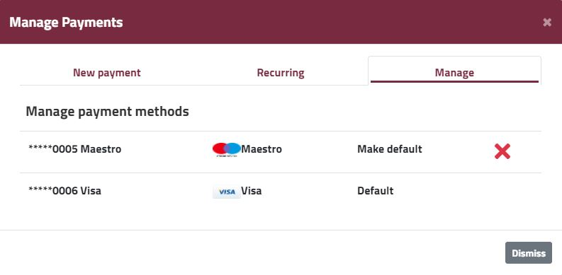

In case you want to add a new card for Enscale payments, or your old card is no longer valid, you will need to [complete a new payment](/account-and-billing/payments/refill-your-balance) via the Enscale dashboard to record the details of your new card.

Once payment is completed, the card will appear in the **Manage** tab of the **Manage Payments** modal.

!!! Don't forget to change your [auto-refill configuration](/account-and-billing/payments/automatic-refills) if applicable. Cards for automatic refill need to be selected each time you wish to use a new card.

If you have several cards on your Enscale account, you have the option to delete non-default cards from our system. If you want to remove the only remaining card in the system, please contact support@enscale.com with your request (provide an invoice number as a security check) and confirm the last 4 digits of the card you would like us to remove.