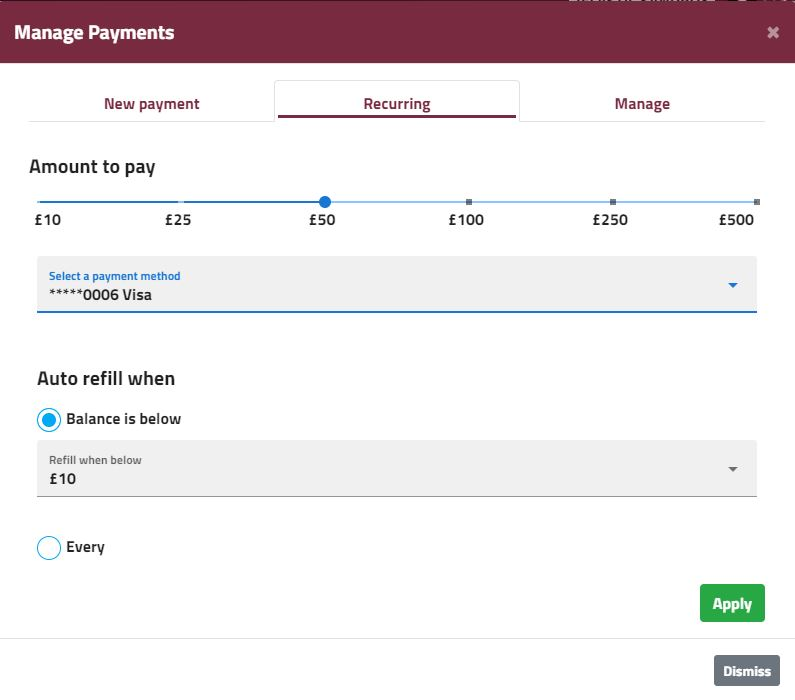
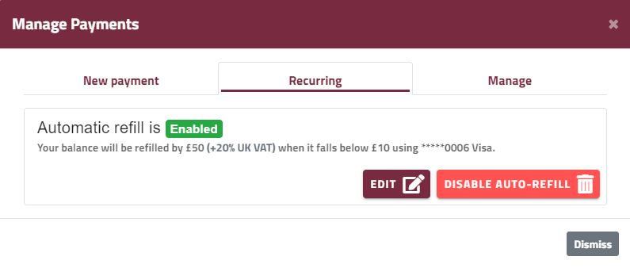

Since Enscale works on a PAYG model, when your balance reaches £0.00, your service will stop working, so it is important to ensure you always have sufficient funds in your account to keep your environments running. The best way to do this is to set up a card that can be charged automatically when your balance falls below a threshold you've defined in advance. This is where auto-refills come in. 

To set up automatic refills, just follow these simple steps:

##### Step 1
Log in to the [Enscale dashboard](https://dashboard.enscale.com).

##### Step 2
Open the **Manage Payments** modal by clicking **Manage payments**.

##### Step 3

In the **Recurring** tab of the modal you will have to set three main things:

1. **Amount to pay** - this is the amount your account will be topped up with each time auto-refill gets activated (+VAT if applicable)
2. **Payment method** - the card that should be used for the automatic payments
3. **Refill trigger** - what should trigger the refill action. 

For accounts with fluctuating resource usage, we recommend to use the **balance is below** trigger and choose an amount that allows for at least a couple of days' regular usage costs. This will ensure that the refill transaction is attempted while there are still sufficient funds in your account. Also, in case the automatic refill should fail (transaction error, bank disallowing payments with the card, etc), you still have time to sort out the payment problems without risking service suspention.

In case you have a fairly regular resource usage and you prefer to handle invoices on a regular interval, you can opt for the **every** option to set up either weekly or monthly payments. In this case, to prevent account suspension, you should ensure that the refill amount is high enough to cover the usage costs for the selected interval.

Once you chose the preferred options, click **Apply** to save these settings.

##### Editing automatic refill settings

In the **Recurring** tab of the **Manage payments** modal you will have the option to change any of your choices regarding automatic refill - amount, card and trigger. In the same place you can also disable auto-refill. 

