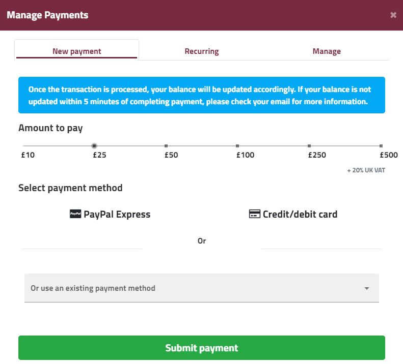

Enscale offers the option for [automatic refills](/account-and-billing/payments/automatic-refills) to ensure that your account is always topped up, however there are cases where you need to refill your balance manually, for example to register a new card in your account. If you need to do a manual refil, you can follow these simple steps:

##### Step 1
Log in to your Enscale account and click the **Manage payments** button on the top left of the dashboard.

##### Step 2

In the **Manage payments** modal you can complete a manual payment in the **New payment** tab, where you will need to set the amount you wish to top up with and the payment method of preference, new or existing. 

PayPal Express payment method is for one-time payment, while a card is saved to your account so it will appear in the drop-down of existing payment methods and you can set it up for recurring payments as well.

##### Step 3
Once you select these, click **Submit payment**. This will either open a new tab with the payment gateway where you can enter details of your new payment method (Sagepay for card payments or PayPal if you wish to use a PayPal account to refill your balance).

##### Step 4

You will see a pending balance for the transaction attempt while the transaction is being processed, for successful transactions the balance will be updated within a few minutes. In case you don't see the funds reflected in our account, please check your emails for any notifications regarding payments or contact us for assistance.

