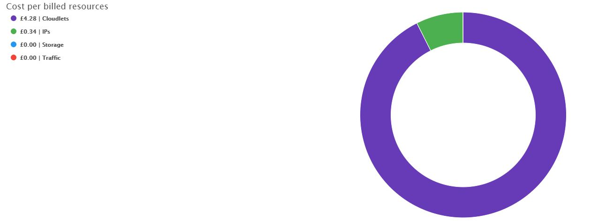
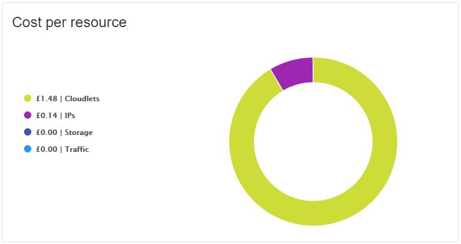
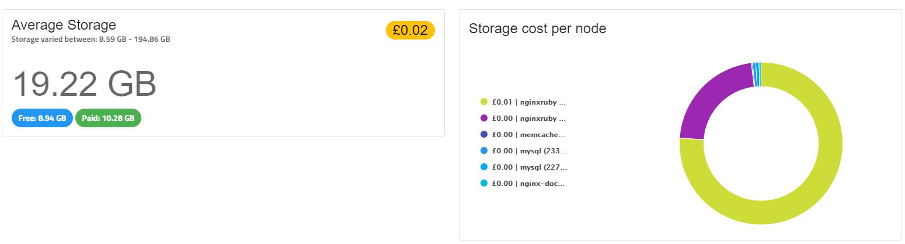
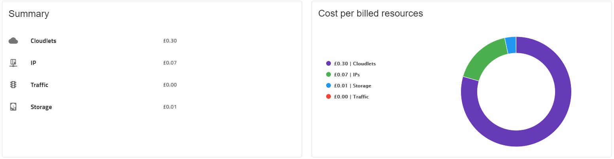
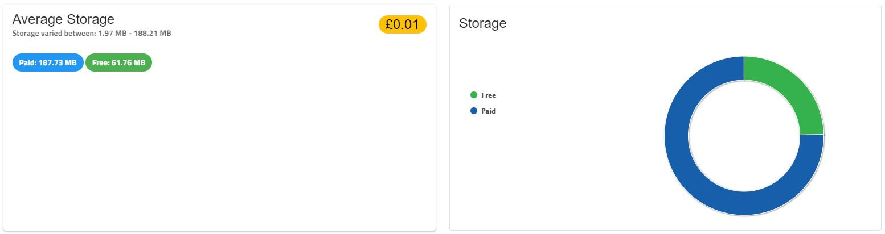
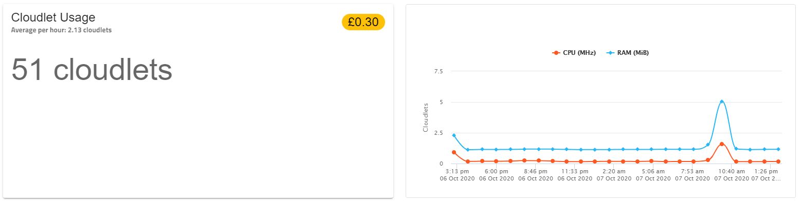
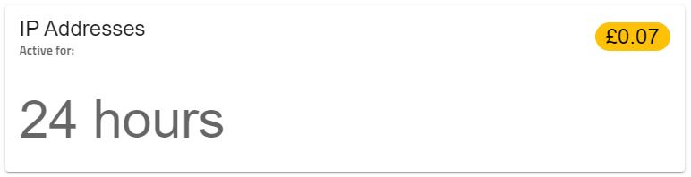

What are all those graphs and what do they mean exactly?

### Account overview

##### Cost per environment

A breakdown of costs per environment can be useful to determine the most resource intensive environments.

##### Cost per billed resources

This graph shows the totals paid per resource for the selected time period.

### Environment costs

When you select an environment from the left-hand side, you can see the cost breakdown for that specific environment.

!!! All nodes will appear that belonged to the environment for the selected period, even if they are deleted currently.

##### Cost per node

##### Cost per resource

##### Total Cloudlet Usage

In the cloudlet usage section you can see the total number of cloudlets used by all the nodes during the selected period as well as the average cloudlets per hour. In the graph next to it you can see a breakdown of that usage per node.

##### Average storage

We provide 10GB of storage free per environment, if you exceed this limit, the overage will be distributed between all of your nodes and will be shown in the graph. 

The free and paid amounts are averages for the queried period. For example if you query the last 24 hours where you used 5GB of disk space for 12 hours then increased it to 15GB, you will see the following calculation: 

* Free: (5x12 + 10x12) / 24 = 7.5 GB
* Paid: 5 x 12 / 24 = 2.5GB

##### Total traffic

2GB / hour of traffic is free of cost in Enscale, so you only see traffic costs if this amount is exceeded. The Paid traffic per node graph will show the node(s) responsible for the excess traffic if the case.

##### Total IP hours

Public IP address as everything else is charged by the hour, so in this section you'll see a table of your nodes and the number of hours there was a public IP attached to them during the queried period.

### Node costs

You can further disect costs by checking each node separately. 

Any node that was active in the environment during the queried period will appear in the tabs, even if it got deleted since, however with limited information (for example cloudlet graphs won't be available for them).

##### Cost per billed resources

For each node in the first section you see the costs broken down per resources.

##### Average Storage

Similarly to the environment view, the paid and free storage is an average for the number of hours in the queried period, however we also show the minimum and maximum used by the node.

Paid storage is distributed proportionally between all of your nodes, so if you've exceeded the 10GB free disk allowed for the environment, you will see a certain amount of paid storage on each of your nodes. 

##### Total Traffic

##### Cloudlet Usage
A cloudlet represents 128MB RAM and 400MHz CPU.

For each our Enscale checks the maximum RAM and average CPU used on the node and "translates" it into a number of cloudlets. If the maximum RAM used is the equivalent of the amount of RAM provided in 2 cloudlets, but the average CPU is only 1 cloudlet, the higher number is considered, so 2 cloudlets will be calculated for that hour.

In the total you see the cummulation of cloudlets during all of the hours of the selected period. You can also see a graph for the selected period to identify peak RAM and CPU usage easily.

##### IP addresses

Here you'll see the number of hours you have had an active IP address on the node for.

