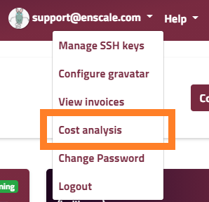
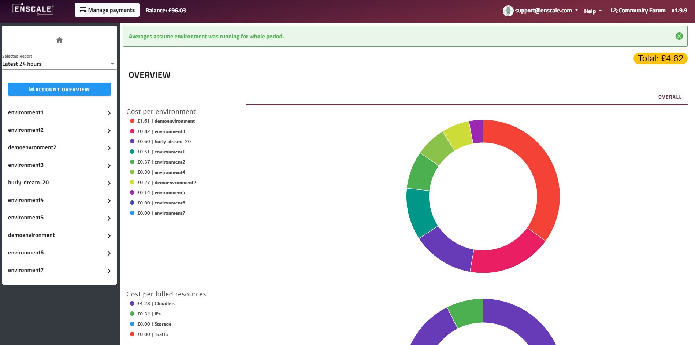

As you probably know by now, with Enscale you pay for the resources you use each hour so we provide you with a detailed cost analysis section where you can keep an eye on what you use and how much you pay for it. 

There are four paid resources in Enscale: 

* Cloudlets (RAM + CPU)
* Public IP address 
* Traffic 
* Disk space

You can access Cost Analysis from the main account dropdown:

You'll be redirected to the cost analysis screen:

