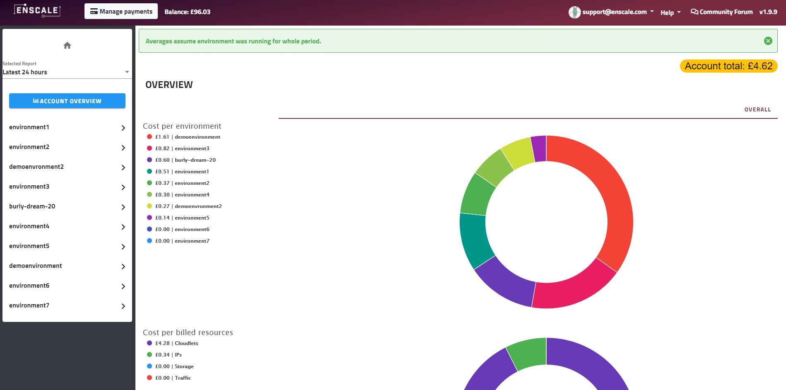
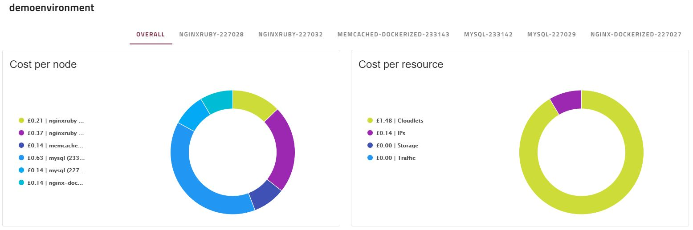

You can access Cost Analysis from the main account dropdown:

You'll be redirected to the cost analysis screen:

Once there you can use the dropdown menu to choose one of the following reports:

* Latest 24 hours
* Latest 30 days
* Specific full month (ex. June, 2020)

The default view shows your entire account's breakdown per environment and per resources used. Click on an environment from the left hand menu to open the report for that specific environment.

Once in the environment, you can dive deeper by selecting a specific node's tab:

