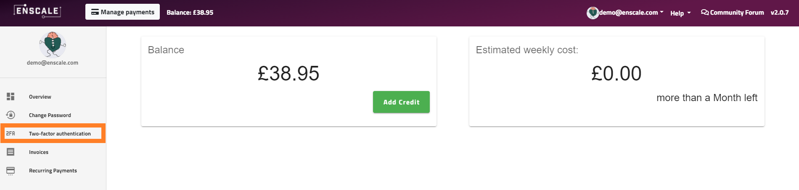
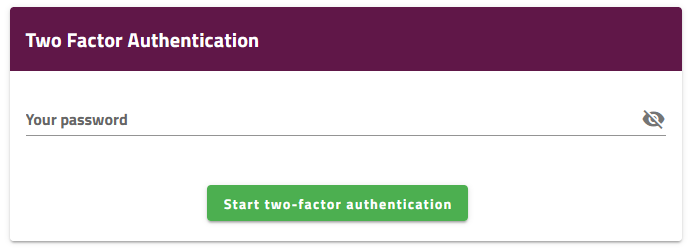
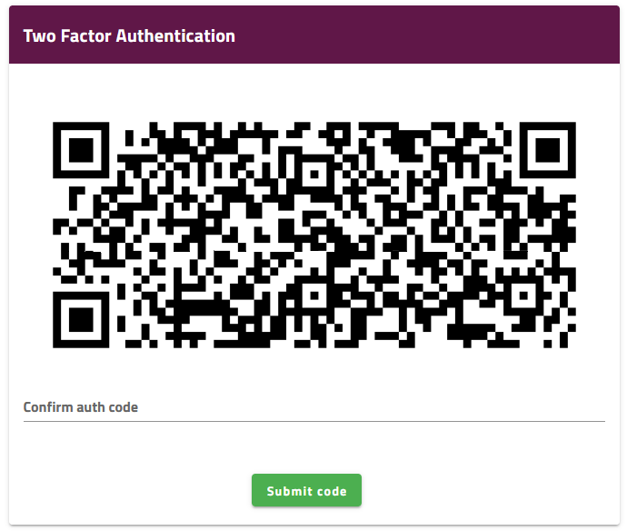

To activate two-factor authentication on your Enscale account, go to **Manage Account** then click **Two-factor authentication** from the left-hand side menu.

Enter your password, then click **Start two-factor authentication**.

You can use any 2FA application to scan the QR code. Enter the authentication code the app provides in Enscale and click **Submit code**.

### Backup Codes

Once you set up 2FA, a list of backup codes is generated. These can be viewed in the dashboard on initial setup, or after a secondary password authentication on subsequent logins.

We strongly recommend that you create a copy of your backup codes in a secure location in case your primary authentication device becomes unavailable.

!!! Each backup code can only be used once.

### Disable 2FA

To disable two-factor authentication, simply return to the Two-Factor Authentication menu, enter your password for confirmation and click **Deactivate 2FA**.

