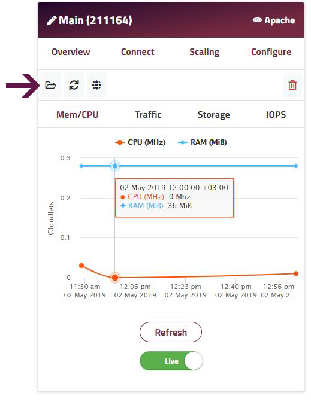

### MANAGE YOUR APPLICATION’S FILES IN THE DASHBOARD

We strongly recommend using **[SSH](/environments/access/access-via-ssh)** and **[SFTP](/environments/access/access-via-sftp)** to make file additions / edits, but sometimes it can be more convenient to make a simple change directly from the comfort of your browser. For example if you're installing Wordpress, you need to rename / edit the _wp-config-sample.php_ to _wp-config.php_ for the application to work.

Enscale makes this very easy:

##### Step 1
Open the [Enscale dashboard](https://dashboard.enscale.com) and enter your environment.

##### Step 2

Each node has its own filesystem. Find the node you wish to work with and click the **Folder** icon to launch the file manager.

##### Step 3

On the left-hand side you will see a file tree. Navigate to the folder you need to and open the file by clicking on it.

##### Step 4

Make the necessary changes and click **Save**. You can **Save As** by changing the filename in the prompt. By ticking the checkbox indicated in the screenshot below, you are able to save the file/changes to all nodes of the same type.

With the **New file** icon you will be able to add a file to the folder you are currently in.

Use the **Delete** icon to remove any files you no longer need.

!!! You cannot add files to read-only folders.