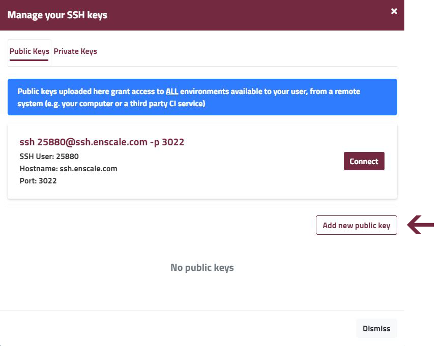
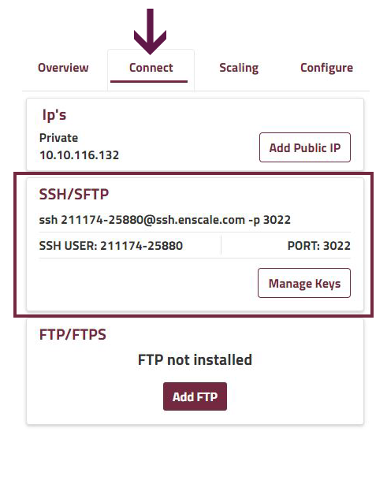

### NON-INTERACTIVE SSH ACCESS

SSH access is a great thing as it enables you to use CLI tools and other commands. If you would like to manually access SSH to perform some simple one-time task, you can see the following [article](/environments/access/access-via-ssh) on detailed steps you need to take.

Some tasks, however, are better automated via scripts. Scripts don't care for niceties like our interactive menu system. They require a slightly different approach. Enscale has a solution for this too, so you can easily provide SSH access to your CI tools, and other scripts using scp, rsync, or SFTP.

To provide SSH access to your script you must define the node that you wish to connect to within the username (since this can't be stated via the interactive menu).

##### Step 1: Add your SSH key to the repository

You can generate your SSH key via [PuTTYgen](/../environments/access/generate-ssh-key#for-windows-clients) if you are a Windows user, or [ssh-keygen](/../environments/access/generate-ssh-key#for-linux-mac-os-users) if you use Mac OS or Linux. You can find detailed instructions in our Generate SSH Key article.

Add the public part of the SSH key to your key repository: username > **Manage SSH Keys**.

Use the **Add new public key** button under the Public Keys tab.

Note that each key you add here has full access to all environments owned by your account, and any other environments shared with you with the Admin permission level.

##### Step 2: Locate your connection details

Enter your environment and select the **Connect** tab for the node you would like to access.

The user information to connect directly to this node can be found below the node's IP addresses:

* SSH user: 211174-25880 (This will be different for you, please check the SSH User in your node’s Connect tab.)
* Hostname: ssh.enscale.com
* Port: 3022

##### Step 3: Create your connection

Use the connection command line in your script to establish direct SSH access to the node.

`ssh SSH-user@ssh.enscale.com -p 3022`

For the above example, the command line would be:

`ssh 130938-20106@ssh.enscale.com -p 3022`

!!! Your environment nodes are secured in a private network. SSH connection and authentication continues to be performed by the SSH gateway, even if using this “direct access” method. If authentication is successful the connection is transparently routed to the required server via the private network.

