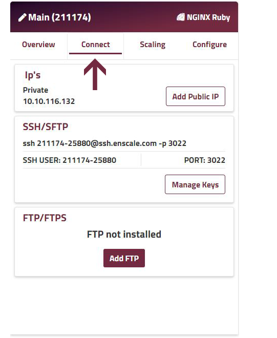
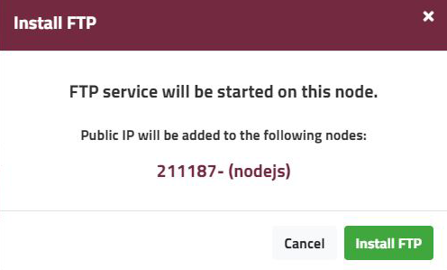
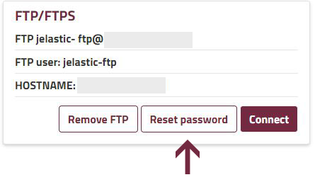
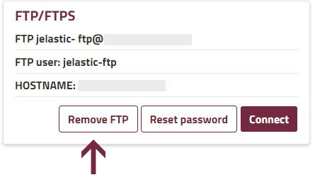
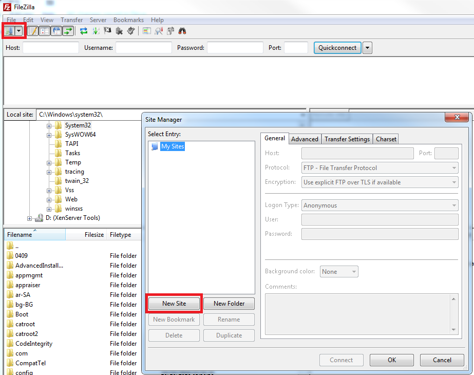
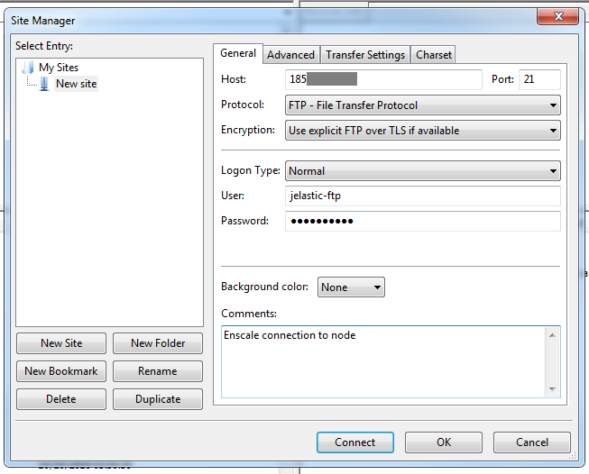
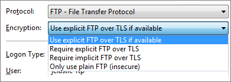

### ACCESS YOUR ENVIRONMENT VIA FTP OR FTPS

You can easily access your application or database nodes via FTP to upload or download resources, log files, modify configuration files, or sync them.

You can connect using plain FTP, or FTP secured with SSL (FTPS) which encrypts both your login details (username and password) and content, for higher security.

FTP connection requires a [public IP](/../environments/features/ip-addresses#using-a-public-ip-address) address on the node that you wish to connect to. If your node doesn’t have one already, it will be added automatically when you activate FTP.

### Install FTP on your nodes

##### Step 1

Open your [Enscale dashboard](https://dashboard.enscale.com) and enter your environment.

##### Step 2

Select the **Connect** tab on your preferred node type.

##### Step 3

Click **Add FTP**. If some nodes of the type you selected do not have a public IP enabled, you will need to confirm that you understand that network traffic will be interrupted and wish to add the required IP addresses by clicking **Install FTP**.

##### Step 4

You will receive a notification email with your username and password. You are able to reset your password anytime by clicking **Reset password**

##### Step 5 - Uninstall

If you wish to uninstall FTP, you can do so easily by going to the Connect tab and selecting **Remove FTP**.

### Connect to your nodes via FTP

In this example, we will be using FileZilla, however the connection details and process should be the same regardless of the FTP client you use.

##### Step 1
 
Create the New Site in FileZilla

##### Step 2

Get your FTP connection details from the Enscale dashboard > Environment > Node > Connect.

##### Step 3

Enter the connection details into the **General** tab of the **New Site** connection details and click **Connect**.

You can choose between **FTP** or **FTPS** connection by selecting the appropriate **Encryption** setting.

!!! We recommend using FTPS connection for higher security.

##### Step 4

Accept the certificate by clicking **OK** for FTPS connection.

##### Step 5

That’s all there is to it. Now you can manage your files easily using your FTP client.