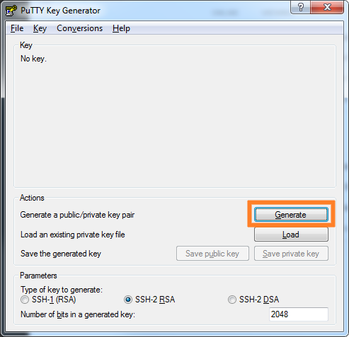
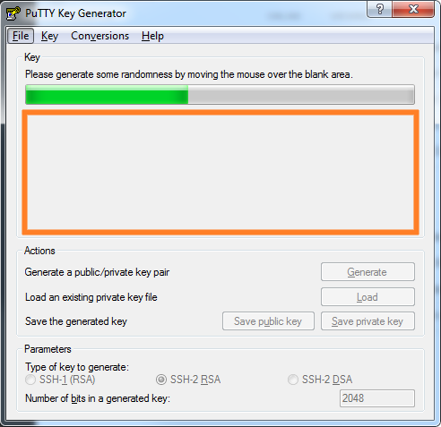
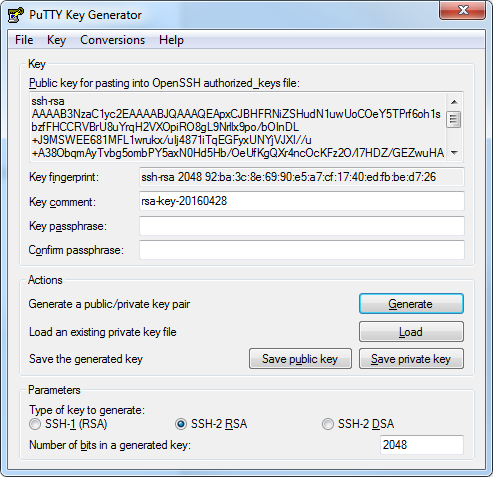
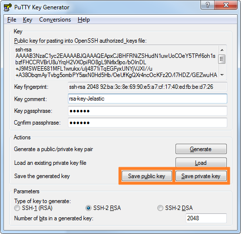
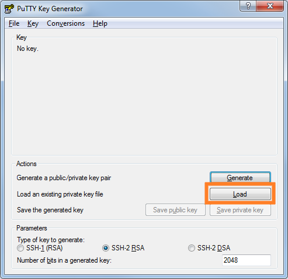
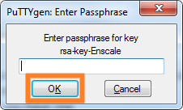

To connect to the gateway (or to your node) via SSH, you will need a private and public SSH key.The private key will be stored on your local machine, while the public key has to be uploaded in your dashboard. When creating the SSH connection, your session loaded with your private key will generate a signature which will be authenticated by the server using the matching public key. Below you will find steps to generate your key pair based on the client you are using.

* [For Windows clients](/access/generate-ssh-key#for-windows-clients)
* [For Linux / Mac OS users](/access/generate-ssh-key#for-linux-mac-os-users)

!!! Key type must be RSA (DSA and Elliptic Curve keys such as ed25519 are not currently supported).


### For Windows clients 

We will use **PuTTYgen** to show you how to generate the SSH key pairs (public and private key) that are used by PuTTY to connect to your server from a Windows client. 

##### Download PuTTYgen

Simply [download PuTTYgen](https://www.puttygen.com/) executable (.exe) file and save it. Since it’s a standalone application, you will not need to perform any installation steps for it.

##### Generate SSH Key

##### Step 1

Open PuTTYgen.

##### Step 2

Select these parameters:

* Enscale requires an SSH-2 RSA
* The number of bits can be either **2048** or **4096** (recommended). This defines the strength of the key and its resistance to brute-force attacks.

##### Step 3

Click the **Generate** button.


##### Step 4

Move your mouse randomly within the empty area to generate your key until the progress bar fills up.


##### Step 5

In the next screen you will see the following:


**Your Public Key**

* You can copy and paste this key directly to your Enscale dashboard. Read [Add your SSH key](/access/add-ssh-key) for detailed steps.

**Your Key Fingerprint**

* This is a unique sequence of letters and numbers that you can use to identify your public key.

**Key comment**

* In this field you should enter something to help you remember what you will use this key for. For example if you are going to use this key pair to connect to your Enscale environments, you could enter ‘Enscale’ here.

**Key passphrase**

* Here you can set a password you can use to encrypt your Private Key. While this is not mandatory, it is strongly recommended to ensure that nobody from your workstation will be able to connect to your server without knowing the passphrase.

!!! If you are using SSH for scripts, you will need to leave the Key passphrase fields empty.

### Save your SSH key

You can either copy and paste your public key into the Enscale dashboard, or you can click the **Save public key** button to save the file on your computer. You can open it with a simple text editor, like Notepad.

You should save the private key on your computer as a .ppk (PuTTY Private Key) file.


### Load a previous SSH key

If you would like to change the comment or passphrase for an existing SSH key, or you would simply like to view the fingerprint or maybe save another copy of the public key, you can always load your SSH key in PuTTYgen.

##### Step 1

Open PuTTYgen.

##### Step 2

Click **Load**.


##### Step 3

Select your SSH Private Key file.

##### Step 4

Enter your passphrase if prompted and click **OK**.


##### Step 5

You will see the Public key, fingerprint and related information in the PuTTY Key Generator window.

! If you make any changes, don’t forget to save your Private key.

 
### For Linux / Mac OS users

If you’re a Mac or Linux user, this article will show you how to use the **ssh-keygen** command to generate the necessary SSH keys required to create an SSH connection to the Enscale gateway or your node, using the command line directly via Terminal.  

##### Step 1

Open the Terminal

##### Step 2

Type or paste the following command in your Terminal Window:
```bash
ssh-keygen -t rsa
```

Hit **Enter**. 

##### Step 3

You will now be prompted to select the location where you wish to save the SSH Keys pair. You can either use the default location by hitting Enter again (please make sure you take note of where the files are saved) or you can use an alternative location by editing the filepath.  

!!! If you’re using Mac OS and you don’t know the exact path of the folder you wish to save the SSH Keys in, simply open that particular directory, expand the settings menu by clicking on this icon   then select Copy Foldername as Pathname - where Foldername is the name of your actual folder. Once you have the folder path, go back to the Terminal and paste the location link followed by /id_rsa (without any spaces between them).
 
##### Step 4

Choose a password (passphrase) or hit Enter if you don’t wish to use one. While you are not required to add a password, it is recommended to do so to kep your key and server protected. (Please note that the terminal won’t display the characters you are typing when entering the password.)

!!! If you are using SSH for scripts, do not set a passphrase for your key.

##### Step 5

After you confirm the password again, the SSH key pair will be generated and you will see a confirmation message similar to the one below:
```shell
Your identification has been saved in /Users/youruser/Desktop/SSH Keys/id_rsa.
Your public key has been saved in /Users/youruser/Desktop/SSH Keys/id_rsa.pub.
The key fingerprint is:
SHA256:+R8+RGiA6SFf0xO+AbPF6UjKik/YUR+ZxcL46DjtHdI enscale@mymac.local

The key's randomart image is:

+---[RSA 2048]----+
|       =oB+o     |
|    . * @**      |
|     * O.Boo     |
|    . * +.+o.    |
|   + * .S...     |
|  o * + E.  .    |
|   o o o ....    |
|    . . .  o..   |
|            o.   |
+----[SHA256]-----+
```

##### Step 6

You can now find your private key, called _id_rsa_ together with the public one, saved as _id_rsa.pub_ in the destination folder you selected earlier or in _/Users/yourusername/.ssh/_ if you used the default location.

!!! If you saved the key in a non-default location, or are working with multiple keys, you can add it to your keychain using the ssh-add command, as simply `ssh-add <path-to-private-key>`, e.g.: `ssh-add "/Users/yourusername/Desktop/SSH Keys/id_rsa"`

The public key is the one you will need to upload to the Enscale dashboard, in order to authenticate your SSH connections. Take a look at the [Add your SSH key](/access/add-ssh-key) article for more information about how to use your newly generated keys. 

 
!! The private key should be kept PRIVATE so please don’t share this with anyone!