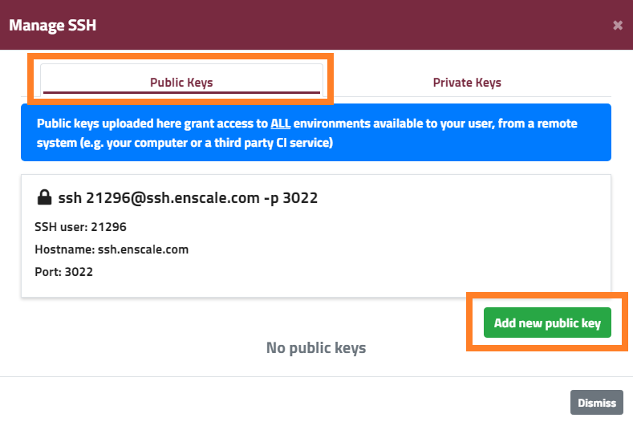

If you need any help with generating your SSH key, please see [this article](/access/generate-ssh-key) for a quick walk-through.

##### Step 1
Log in to your Enscale dashboard.

##### Step 2
Select **Manage SSH Keys** from the drop-down menu under your account email address.

##### Step 3
Switch to the tab for the type of key you'd like to add *Public* or *Private* and click **Add new public key**.

!!! Key type must be RSA (DSA and Elliptic Curve keys such as ed25519 are not currently supported).

##### Step 4
Enter a title to help you identify your key, add your public key and click **Add Key**.

##### Step 5
You can delete your public key anytime clicking the **Delete** icon

