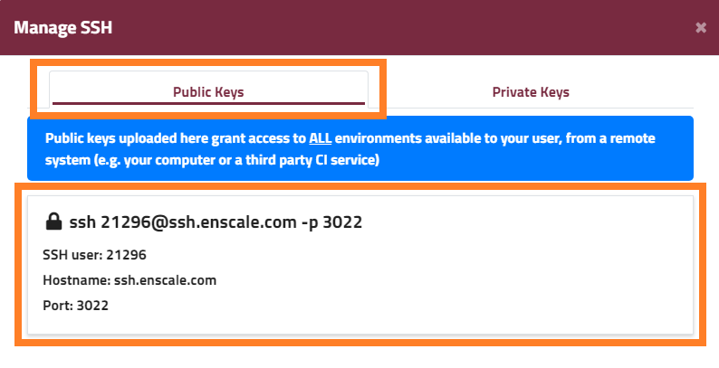
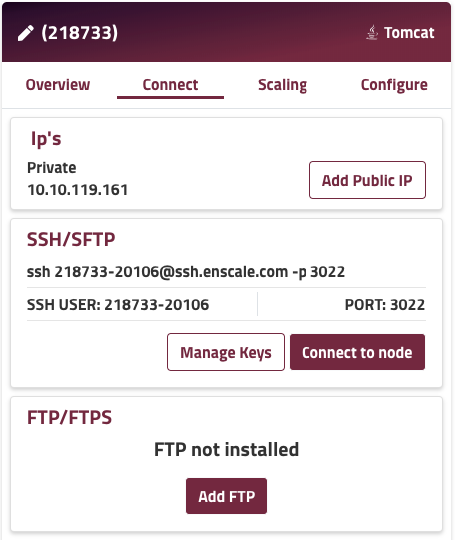

Enscale offers two possible options to SSH. The firs option is to connect to the SSH gateway. This will present you with a list of all your environments and you can connect to either one for them, once in an environment you can connect to any node of your choice. If you'd like to bypass the gateway, you can establish a connection to a specific node directly.

!!! Prerequisit to establishing a connection is to [have your public key added](/access/add-ssh-key) to the Enscale dashboard. Key type must be RSA (DSA and Elliptic Curve keys such as ed25519 are not currently supported).

##### Connect to the SSH gateway

If you’re a Linux or Mac user, you can just click on the **Connect** button of your node in your dashboard and it’ll open up a terminal ssh session with those details on your behalf.

If you are using a GUI based client, like PuTTY or SecPanel, you will probably need to manually configure the session details. You will find all this information in your dashboard under **Manage your SSH keys**.

* SSH user: 0106 (this will be unique for you, so please check your own dashboard) 
* Hostname: ssh.enscale.com 
* Port: 3022

!!! The default port number for SSH is 22. You must change your SSH client settings to use port 3022 for this connection or it will not work!

##### Connect to a specific node directly

The direct node connection details can be found in the **Connect** tab of each of your nodes.

* SSH user: 218733-20106 (this will be unique for you for each node, so please check your own dashboard) 
* Hostname: ssh.enscale.com 
* Port: 3022

!!! The default port number for SSH is 22. You must change your SSH client settings to use port 3022 for this connection or it will not work!

If you’re a Linux or Mac user, you can just click on the **Connect to node** button of your node in your dashboard and it’ll open up a terminal ssh session with those details on your behalf. If you are using a GUI based client, like PuTTY or SecPanel, you will probably need to manually configure the session details. 

