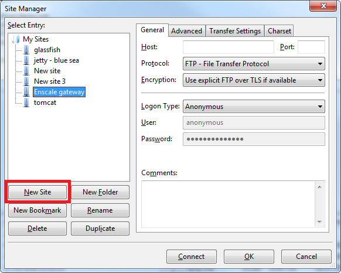
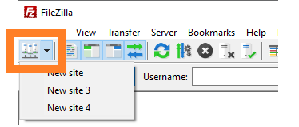

In some cases, you will need to manually connect to your application node via SFTP for uploading files to make small changes in your application or to use in scripts. Enscale allows you to do this easily with any SFTP client.

In order to connect via SFTP, you will need to [create an SSH key pair](/access/generate-ssh-key) and [upload your public key](/access/add-ssh-key) to the Enscale dashboard. Key type must be RSA (DSA and Elliptic Curve keys such as ed25519 are not currently supported).

##### Connect to your node using SFTP

In this example, we will be using Filezilla, however your connection details are the same regardless of what client you are using.

##### Step 1

Set up a new connection using the connection parameters.

##### Step 2

Configure the site.

For this you will need the connection details from the specific node you would like to access. You will find this in the **Connect** tab.

?resize=300,300)
&nbsp;

&nbsp;

* Hostname: ssh.enscale.com
* Port: 3022
* Encryption type: SFTP
* Logon Type: Key File
* User: the number you see in your SSH user field
* Upload your Private Key file
&nbsp;

&nbsp;

&nbsp;

Set up your connection details

##### Step 3
Load the saved site to connect.

##### Step 4
Enter your Key passphrase and click **OK**.

##### Step 5
You are ready to manage your files via SFTP.