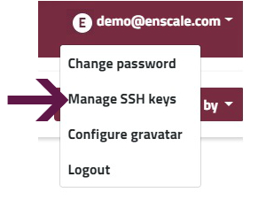
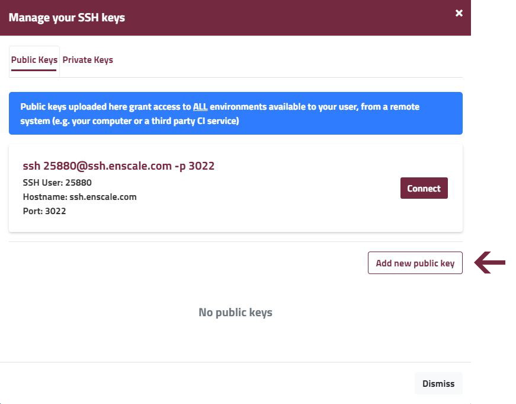
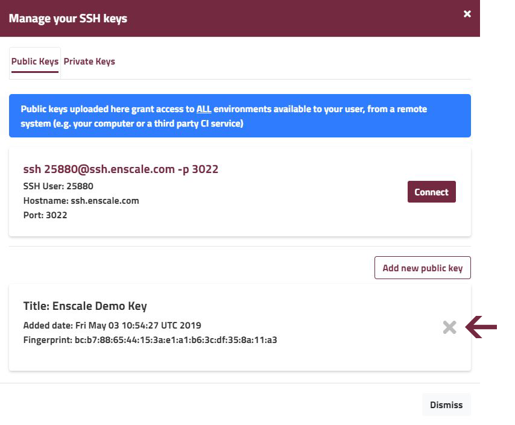

### ACCESS YOUR ENVIRONMENT VIA SSH

Enscale does all the server admin tasks for you, but we know how a lot of times SSH access can be important.

SSH access enables you to install and run your own CLI code or custom git or svn commands, you might need. You can, for example run Composer or other PHP dependency managers, as well as access asadmin and similar application server level CLI tools.

Maybe you would like to push code changes from your environment back to your repository or you need to run commands for conflict resolution. 

Having SSH access also give you power to import or export large .sql databases without worrying about php script upload/timeout limitations imposed by phpMyAdmin/phpPgAdmin.

One thing to keep in mind though when you’re using SSH for git and svn commands is that projects created entirely through SSH will not appear within your Enscale dashboard.

Enscale application servers do not have database command line clients installed so you will need to connect to the desired database server to access these commands (e.g. mysql, mongo, psql).

### How does SSH work in Enscale?

We use an intermediary SSH Gateway to provide SSH access in Enscale, so your individual servers do not require their public IP for SSH access. The gateway uses key based authentication and then provides you with a simple text driven menu to access the desired node from any of your running environments.

### Your SSH connection settings

You can find your SSH connection settings by clicking on your email address in the top right-had corner and clicking **Manage SSH keys**.


SSH connection settings

* Username - SSH user (ex. 25880 - this is unique for you, so please check your dahsboard)
* Authentication - SSH key
* Host - ssh.enscale.com
* Port - 3022
* SSH fingerprint
 				- RSA (92:ba:3c:8e:69:90:e5:a7:cf:17:40:ed:fb:be:d7:26)
                - DSA (26:2d:93:72:38:8c:72:28:63:a2:32:d7:1c:aa:78:53)
                
### Add your SSH key

If you need any help with generating your SSH key, please see [this article](/environments/access/generate-ssh-key) for a quick walk-through.

##### Step 1
Log in to your Enscale dashboard.

##### Step 2
Select **Manage SSH Keys** from the drop-down menu under your account email address.


##### Step 3
Click **Add new public key**.


##### Step 4
Enter a title to help you identify your key, add your public key and click **Add Key**.

##### Step 5
You can delete your public key anytime clicking the **Delete** icon


### Connect to the SSH gateway


If you’re a Linux or Mac user, you can just click on the connect button of your node in your dashboard and it’ll open up a terminal ssh session with those details on your behalf.

If you are using a GUI based client, like PuTTY or SecPanel, you will probably need to manually configure the session details. You will find all this information in your dashboard under **Manage your SSH keys**.

* SSH user: 25880 (this will be unique for you, so please check your own dashboard) 
* Hostname: ssh.enscale.com 
* Port: 3022

!!! The default port number for SSH is 22. You must change your SSH client settings to use port 3022 for this connection or it will not work!

### User permissions

You are logged in as the primary system user for the service on each node. On an Apache node this would mean you are logged in as the apache system user, while on a MySQL node you will be logged in as the mysql system user and so on. This is generally preferable for running certain application utilities (ex drush) and it also simplifies file ownership and access issues.

Please keep in mind that since Enscale is a PaaS, you will not have root level access, so you will not be able to - or need to - install or update system rpm’s.However, you do have limited sudo permission to run selected commands, such as `sudo service httpd restart`:

```bash
apache@node124718-cool-waterfall-59 /etc/httpd/conf $ sudo service httpd restart
Stopping httpd:                                            [  OK  ]
Starting httpd:                                            [  OK  ]
```

If you receive a password prompt while using sudo, it means that you do not have permission to run that specific command. In this case, if running the command is essential for your needs, please [contact our technical support team](mailto:support@enscale.com) for a solution.


