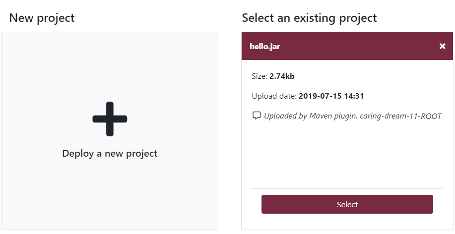
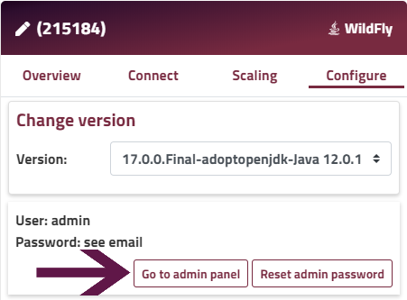

### HOW TO DEPLOY FROM WAR OR EAR

You can deploy your Java application directly by uploading your WAR or EAR file either through the Enscale dashboard (or via SFTP if larger than 150 MB). Upload your archive and let Enscale take care of the rest.

### Deploying Java application WAR or EAR up to 150MB

##### Step 1
Log in to your Enscale dashboard and create a Java environment if you haven’t already.

##### Step 2

Enter your environment and click **Deploy** to enter the Deployment manager.

##### Step 3

Click on New deployment (if this is your first deployment on the environment, this step is skipped automatically).

##### Step 4
The default setting deploys to the ROOT folder, which corresponds to the default DocumentRoot in the web server configuration. If you would like to deploy to a different location, just specify a directory name (new or existing) in the Deploy to box.

The ROOT folder is the one the web server is preconfigured to serve content to when accessing your environment. If you deploy your application to a subfolder, you will need to set a different DocumentRoot in your configuration file. Unless you make the modifications mentioned above, your application will be accessible by including the subfolder in the URL, ex. http://cool-waterfall-59.uk.enscaled.com/hello-world.

If your environment has multiple applications you can configure name based virtual hosts to specify different application roots per domain.

!!! Not all Java nodes allow deployment to multiple contexts. If your node type does not support this feature, this step will be skipped automatically.

##### Step 5

In case you already deployed your project, it will show here so you don't need to upload it multiple times, just click **Select**. If your project is new, click **Deploy a new project**.

##### Step 6

Select the Archive tab, find and upload your archive by clicking Browse. Alternatively from the Remote URL tab you just need to enter the link to the file.

!!! This option has a maximum upload limit of 150MB. If your project archive is larger, you can upload and deploy manually.

##### Step 7
Enter a description for your file - this comment will be attached to your project and will help you identify it in case you want to deploy the same project to several environments.

##### Step 8
Click **Deploy**

!!!! Now that your code is deployed, you may wish to [configure the DNS](/environments/features/add-domain-name) for your domain.

### Deploying Java application WAR or EAR larger than 150MB

##### Nodes with admin consoles (GlassFish, Payara, WildFly)

Use the admin consoloe to upload and deploy the file manually.

To access the admin console, go to the node's **Configure** tab and click **Go to admin panel**.

##### Nodes without admin console (Java Engine, Jetty, Tomcat, TomEE+, Spring Boot)

##### Step 1

Set up your SSH and SFTP connection. If you need any assistance with this, you can see our articles [Access your environment via SSH](/environments/access/access-via-ssh) or [Access your environment via SFTP](/environments/access/access-via-sftp).

##### Step 2

Connect to your node via SFTP and upload your archive.

!!! We recommend uploading your file in the default directory: /webapps or /APP

##### Step 3

Tomcat, TomEE+ default server.xml includes autoDeploy=true to monitor the webapps directory and automatically deploy any new .war file added.

Similarly, the Jetty default jetty-deploy.xml is configured to scan the webapps directory every second and automatically deploy any new .war file added.

If you modify these defaults, or use a different application server, you may need to perform additional steps to complete the deployment. Please consult the application server documentation accordingly.

!!! The deployment context depends on your .war file name. For example root.war will be deployed to http://www.your-domain.com/ context, while example.war will be deployed to http://www.your-domain.com/example.