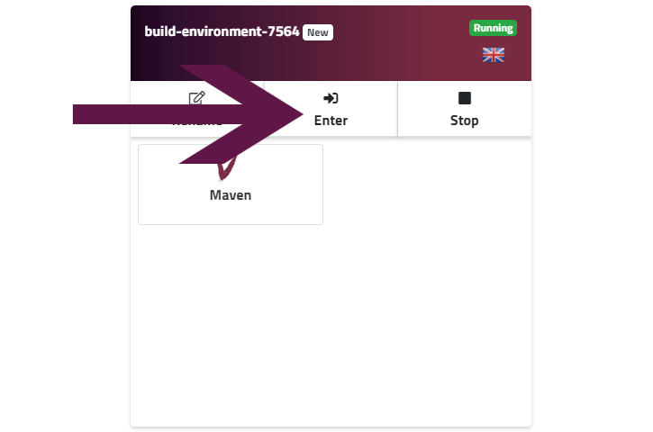
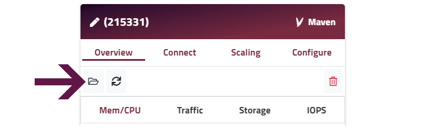
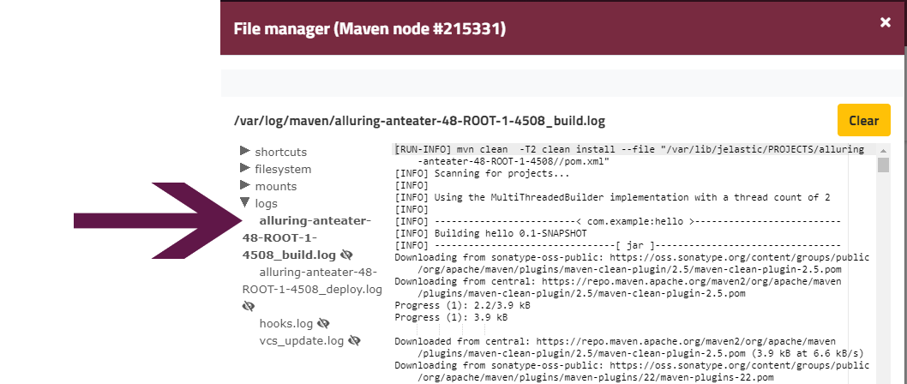

### MAVEN BUILD NODE

When you deploy any Java application from git or SVN, the Maven build node is used to build your project and deploy it to your target node(s). Enscale creates a build environment for you automatically during deployment unless one is detected and active.

! For automatic deployments to work, please keep your build environment running.

### Logs

While deploy logs will be present in the target environment as well, Maven has separate build and deploy logs for each of your projects, which can be accessed from the Maven node's file manager. We recommend to check these for troubleshooting deployment issues.

##### Step 1
Enter your Maven build environment.

!!! Your build environment will be named by default (_build-environment-randomnumber_), you will also receive an email with the environment name.

##### Step 2
Open the file manager.

##### Step 3

Click on the _Logs_ folder in the filetree to see the available log files.

Click on the log file of your choice to open it.

To easily identify which deployment a log file pertains to, each log file follows the naming convention of: `[environment-name]-[directory-of-deployment]-[random-number]`

You will have the following logs for each of Git and SVN deployments:
* Build log
* Deploy log

In the _vcs\_update.log_ you will be able to find information about all Git/SVN deployments to Java environments from your account. Similarly _hooks.log_ will provide information about any deployment hooks you've set for any of your Java deployments.

!!! The _vcs\_update.log_ and _hooks.log_ files are not specific to any environment, but you can use CTRL+F to find the relevant environment faster.

