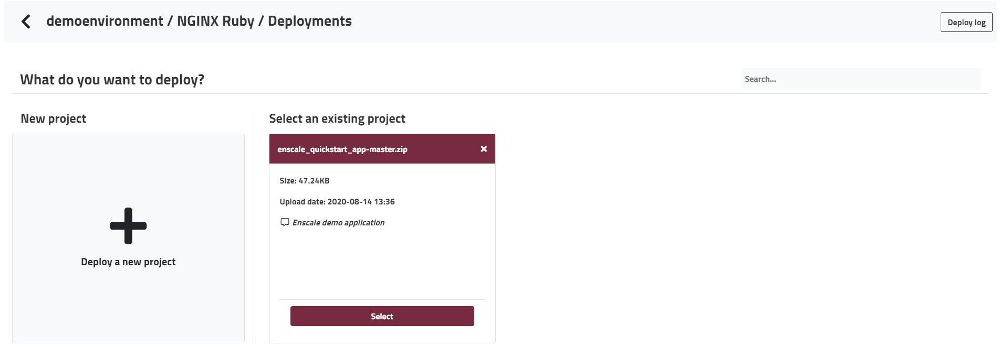

Uploading all your files via FTP can be a tedious process, especially if you have lots of tiny files. With Enscale we made things easy for you, you can deploy directly from an archive. The below method will work for archives up to 150MB, for larger archives, please see here.

##### Step 1
**Enter** your environment. 

##### Step 2
Click the **Deploy** button to get to the **Deployment manager**.

##### Step 3
If you have no deployments on this environment, you're presented with a list of deployed projects. Any archive you upload via the dashbaord will be saved and can be selected from here in future, so you don't need to upload it multiple times, just select it. To add a new archive, click **Deploy a new project**

##### Step 4
Select the **Archive** tab. 

##### Step 5

You can find and upload your archive from your computer by clicking **Browse**, alternatively you can use an upload link in the **Remote URL** tab.

Once the archive us uploaded, you will be prompted to enter a **description** for your file - this comment will be attached to your project and will help you identify it in case you want to deploy the same project to several environments.

##### Step 6

Click **Deploy**.

!!!! Enscale will unpack your archive so once the deployment process is complete and runs bundle as well as any commands specified in your [_rake_\__deploy_](/app/rake) file, so you should already have your project up and running.

