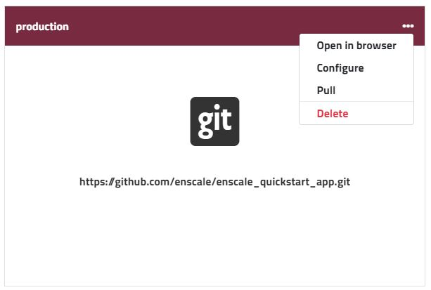
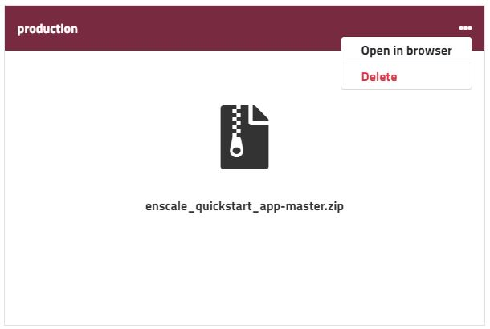

Whether your deployment is from git or you uploaded an archive, all deployments made via the Enscale dashboard can be managed in your **Deployment Manager**. The deployment manager is accessible from within your environment by clicking the **Deploy** button.

Once here, open the dropdown menu to see the available actions for each deployment type.
* [Git deployments](/getting-started/deployments/deployment-manager#manage-git-deployments)
* [Archive deployments](/getting-started/deployments/deployment-manager#manage-archive-deployments)

### Manage Git deployments

##### Open in browser

This is a direct link to your application. 

##### Configure

In this section you're able to change all the deployment settings:

**URL**: change the URL of your git repository

**Auto-update**: toggle on or off as well as select the desired interval for checking whether there were any changes made to your repository. If changes are detected, a `svn update` is performed.

**Auto-resolve conflict**: enabling this feature prevents merge conflicts (any locally made change will be discarded if it conflicts with your repository)

**Deploy hooks**: set scripts to run before or after each deployment

##### Pull

The **Pull** option initiates a `git pull` from your Git repository.

##### Delete

As the name suggests, this will remove your deployment completely from your environment.

### Manage archive deployments

!!! Only archives deployed directly from the Enscale dashboard will show up here.

##### Open in browser

This is a direct link to your application. For example a deployment to *demo* subfolder would open http://your-environment.uk.enscaled.com/SAMPLE-ARCHIVE-DEPLOYMENT

##### Delete

As the name suggests, this will remove your deployment completely from your environment.

