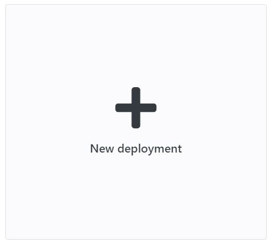

### DEPLOY YOUR PHP APPLICATION FROM A ZIP OR TAR ARCHIVE

Uploading all your files via FTP can be a tedious process, especially if you have lots of tiny files. With Enscale we made things easy for you, you can deploy directly from ZIP.

Depending on the size of your ZIP archive, you can use one of the two methods outlined below.

### Deploying a PHP application from ZIP or TAR archive up to 150MB

##### Step 1

Create your PHP environment.

##### Step 2

Enter your environment and go to the deployment manager by clicking the **Deploy** button.

##### Step 3

Click on **New deployment** (if this is your first deployment on the environment, this step is skipped automatically).

##### Step 4

The default setting deploys to the ROOT folder, which corresponds to the default DocumentRoot in the web server configuration. If you would like to deploy to a different location, just specify a directory name (new or existing) in the **Deploy to** box.

The ROOT folder is the one the web server is preconfigured to serve content to when accessing your environment. If you deploy your application to a subfolder, you will need to set a different _DocumentRoot_ in your _httpd.conf_ file if you are using Apache and a different location root in _nginx.conf_ if you have an Nginx application node.

**Apache:**

`DocumentRoot "/var/www/webroot/ROOT/wordpress"`

**Nginx:**

`Location / {Root /var/www/webroot/ROOT/wordpress;…}`

Unless you make the modifications mentioned above, your application will be accessible by including the subfolder in the URL, ex. http://cool-waterfall-59.uk.enscaled.com/wordpress. 

If your environment has multiple applications you can configure name based virtual hosts to specify different application roots per domain.

!!! To deploy something new to an already existing folder, you need to delete the original deployment first.

##### Step 5

In case you already deployed your project, it will show here so you don't need to upload it multiple times, just click **Select**. If your project is new, click **Deploy a new project**. 

##### Step 6

Select the **Archive** tab, find and upload your archive by clicking **Browse**.
Alternatively from the **Remote URL** tab you just need to enter the link to the file.

The following archive types are supported: _.tar_, ._tar.gz_, _.zip_ and _.bzip2_

!!! The default upload limit is 150MB. If your project archive is larger, please see the section [below](/php/deployments%20guide/zip-or-tar-archive#deploying-a-php-application-from-zip-or-tar-archive-larger-than).

##### Step 7

Enter a description for your file - this comment will be attached to your project and will help you identify it in case you want to deploy the same project to several environments.

**Zero downtime** option is also available for PHP deployments to ROOT folder, toggle on to activate it. Details are [here](/php/deployments%20guide/zero-downtime-deployment).

##### Step 8

Click **Deploy**.

!!!! Now that your code is deployed, you may wish to [configure the DNS](/environments/features/add-domain-name) for your domain.

### Deploying a PHP application from ZIP or TAR archive larger than 150MB

##### Step 1

Set up your SSH and SFTP connection. If you need any assistance with this, you can see our articles [Access via SSH](/environments/access/access-via-ssh) and [Access via SFTP](/environments/access/access-via-sftp) for detailed instructions.

##### Step 2
Connect to your node via SFTP and upload your archive. You can upload the following archive types: _.tar_, _.tar.gz_, _.zip_ and _.bzip2_

##### Step 3
Connect to your node via SSH.

##### Step 4

Locate your uploaded file and use the `unzip` or `tar` command to extract your files.

**.zip archives:**

`apache@node124718-cool-waterfall-59 ~/webroot/ROOT/wp $ unzip wp.zip`

**.tar archives:**

`apache@node124718-cool-waterfall-59 ~/webroot/ROOT/wp $ tar -xfv wp.tar`

**.tar.gz archives:**

`apache@node124718-cool-waterfall-59 ~/webroot/ROOT/wp $ tar -xzfv wp.tar.gz`

**.bzip2 archives**:

`apache@node124718-cool-waterfall-59 ~/webroot/ROOT/wp $ tar -xjfv wp.bzip2`

!!!! Now that your code is deployed, you may wish to [configure the DNS](/environments/features/add-domain-name) for your domain.