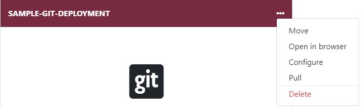
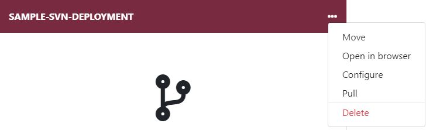
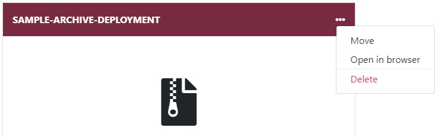

Whether your deployment is from git, SVN or you uploaded an archive, all deployments made via the Enscale dashboard can be managed in your Deployment Manager.

To access your Deployment Manager enter your environment and click **Deploy**.

Once here, open the dropdown menu to see the available actions for each deployment type.
* [Git deployments](/php/deployments%20guide/managing-deployments#manage-git-deployments)
* [SVN deployments](/php/deployments%20guide/managing-deployments#manage-svn-deployments)
* [Archive deployments](/php/deployments%20guide/managing-deployments#manage-archive-deployments)

### Manage Git deployments

##### Move

Use the **Move** option to specify a new folder or directory to place your deployed project in. If the folder doesn't exist, it will be created.

!!! You will need to update your configuration files manually with the new path.

##### Open in browser

This is a direct link to your application. For example a deployment to *demo* subfolder would open http://your-environment.uk.enscaled.com/SAMPLE-GIT-DEPLOYMENT

##### Configure

In this section you're able to change all the deployment settings:

**Login**: change username

**Password**: update password

**URL**: change the URL of your SVN repository

**Auto-update**: toggle on or off as well as select the desired interval for checking whether there were any changes made to your repository. If changes are detected, a `svn update` is performed.

**Auto-resolve conflict**: enabling this feature prevents merge conflicts (any locally made change will be discarded if it conflicts with your repository)

**Enable zero downtime**: toggle on to avoid downtime during deployment

**Deploy hooks**: set scripts to run before or after each deployment

##### Pull

The **Pull** option initiates a `git pull` from your Git repository.

##### Delete

As the name suggests, this will remove your deployment completely from your environment.

### Manage SVN deployments

##### Move

Use the **Move** option to specify a new folder or directory to place your deployed project in. If the folder doesn't exist, it will be created.

!!! You will need to update your configuration files manually with the new path.

##### Open in browser

This is a direct link to your application. For example a deployment to *demo* subfolder would open http://your-environment.uk.enscaled.com/SAMPLE-SVN-DEPLOYMENT

##### Configure

In this section you're able to change all the deployment settings:

**Login**: change username

**Password**: update password

**URL**: change the URL of your SVN repository

**Auto-update**: toggle on or off as well as select the desired interval for checking whether there were any changes made to your repository. If changes are detected, a `svn update` is performed.

**Auto-resolve conflict**: enabling this feature prevents merge conflicts (any locally made change will be discarded if it conflicts with your repository)

**Enable zero downtime**: toggle on to avoid downtime during deployment

**Deploy hooks**: set scripts to run before or after each deployment

##### Pull

The **Pull** option initiates a `svn update` from your SVN repository.

##### Delete

As the name suggests, this will remove your deployment completely from your environment.

### Manage archive deployments

##### Move

Use the **Move** option to specify a new folder or directory to place your deployed project in. If the folder doesn't exist, it will be created.

!!! You will need to update your configuration files manually with the new path.

##### Open in browser

This is a direct link to your application. For example a deployment to *demo* subfolder would open http://your-environment.uk.enscaled.com/SAMPLE-ARCHIVE-DEPLOYMENT

##### Delete

As the name suggests, this will remove your deployment completely from your environment.

