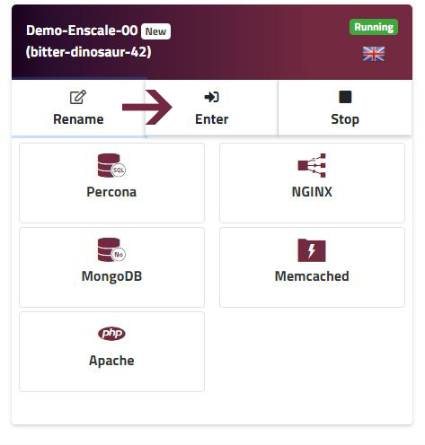

Enscale gives you easy access to your logs in the same way as your other files, using the dashboard file manager.

##### Step 1

Enter your environment.

##### Step 2

Open the **File manager** from your application node.

##### Step 3

Click on Logs in the file tree from the left-hand side.

##### Step 4

Click on any log file to view it.

##### Step 5

You can navigate with the **Next** and **Prev** buttons.

You can clear a log file with the **Clear** button.

