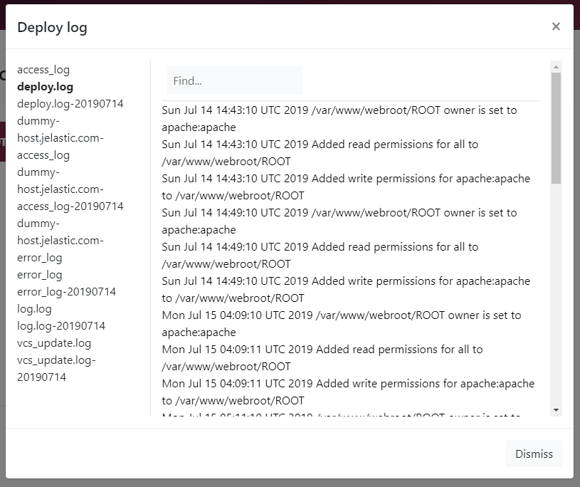

Log files contain important information about what happened in your environments. They should be your first step when troubleshooting, because often an application code or configuration error is logged very clearly, allowing you to resolve the issue in no time.

Enscale gives you easy access to your logs in the same way as your other files, using the dashboard [file manager](/environments/access/file-manager).

Each node is configured with default logs as part of the server's standard configuration. You may wish to make changes to the log format, or if you're hosting multiple domains within one environment you may find it convenient to split the logs by domain. Consult the official server documentation for the configuration options.

### How to view your log files

##### Step 1

Enter your environment.

##### Step 2

Open the **File manager** from your application node.

##### Step 3

Click on Logs in the file tree from the left-hand side.

##### Step 4

Click on any log file to view it.

##### Step 5

You can navigate with the **Next** and **Prev** buttons.

You can clear a log file with the **Clear** button.

### Git/SVN logs

For Java environments you can find the deployment logs in the Maven build node, check [here](/java/deployment-guides/maven-build-node#logs) for further information.

For anything else, you can view your Git/SVN deployment logs (vcs_update.log) files directly from the deployment manager by following these steps:

##### Step 1

Open the deployment manager by clicking the **Deploy** button.

##### Step 2

Click **Deploy log** in the upper right-hand side to see your deployment related log files.

##### Step 3

Select the log file of your choice to view it.

### Cron logs

Enscale does not provide access to the operating system cron logs (they do not generally help). However, you can create your own cron log files for your tasks.

To do this, simply specify the output file location in crontab.

`59 23 * * * /var/www/webroot/ROOT/script.sh >> /var/log/httpd/script.log 2>&1`

The example above will redirect output of the cron job and error messages to a _script.log_ file.

You can also set up the output to be emailed to you upon completion by setting a MAILTO variable at the beginning of the crontab:

` MAILTO=”you@domain.com”`

If you don’t want all output to go to the same email address you can specify the output of a particular script to go to a different email address:

`59 23 * * * /var/www/webroot/ROOT/backup.sh >> /var/log/httpd/backup.log 2>&1 | mail -s "backup" you@domain.com`

### Audit log

You can check past actions (performed by you or your collaborators) for each environment from the environment view.

Click on the **Actions** drop-down and select **Audit log**.

You will see the timestamp, the action, status (success or error) as well as whether the action was performed in your account or that of a collaborator.

