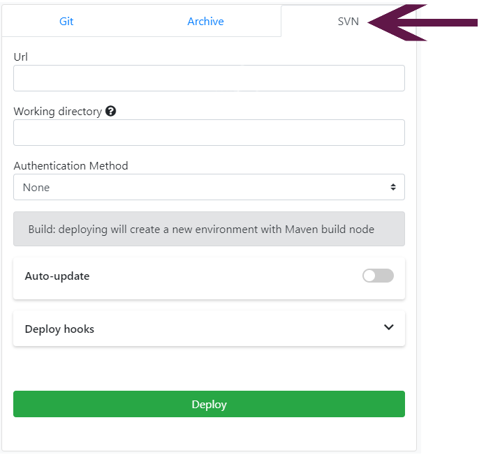

### DEPLOY FROM SVN

There are very few developers nowadays who don’t use some sort of source control management tool. Your repository can be anywhere on the Internet - as long as you are using subversion as a source control management tool, we've got you covered!
Enscale’s mission is to make life really easy for developers, so we give you the option to deploy code directly from your SVN repository.

### Deploy your application

##### Step 1
Log in to your Enscale dashboard and create a JAVA environment if you haven’t already.

##### Step 2
Enter your environment and click **Deploy**.

##### Step 3
Click on **New deployment** (if this is your first deployment on the environment, this step is skipped automatically).

##### Step 4
The default setting deploys to the ROOT folder, which corresponds to the default DocumentRoot in the web server configuration. If you would like to deploy to a different location, just specify a directory name (new or existing) in the **Deploy to** box.

The ROOT folder is the one the web server is preconfigured to serve content to when accessing your environment. If you deploy your application to a subfolder, you will need to set a different DocumentRoot in your configuration file. Unless you make the modifications mentioned above, your application will be accessible by including the subfolder in the URL, ex. http://cool-waterfall-59.uk.enscaled.com/test.

If your environment has multiple applications you can configure name based virtual hosts to specify different application roots per domain.

!!! Not all Java nodes allow deployment to multiple contexts. If your node type does not support this feature, this step will be skipped automatically.

##### Step 5
In case you already deployed your project, it will show here so you don't need to upload it multiple times, just click Select. If your project is new, click **Deploy a new project**.

##### Step 6

Select the **SVN tab** from the drop-down menu to provide us with a link to your repository.

**URL**: the URL of your git repository

**Branch**: the repository branch you wish to checkout!

**Working directory**: relative path to the repo subdirectory containing the application source code

**Authentication method**:

* **None**: use this if your git repo does not require authentication
* **Password**: select this to authenticate with git by username and password

**Build**: Enscale will create a new environment with a Maven build node to build and deploy your application. If you have one already it will be selected automatically.

**Auto-update**: turn this on for Enscale to check your repository regularly for updates. The frequency of checks is set by you in the auto-update interval section. If any changes are detected, Enscale will also re-deploy your application.

**Auto-resolve conflicts**: toggle on instructs Enscale to update any contradictory files to the ones in the repository to prevent merge conflicts during re-deploy.

**Deploy hooks**: Here you can enter custom scripts to run before (Pre) or after (Post) deployment. Enter the script in the appropriate tab and click **Apply** to save it.

​

##### Step 7
Click **Deploy**.

### Handling conflicts during updates

**The recommended workflow is**:

* Make changes on your local development environment
* Commit to subversion.
* Update your Enscale environment

If you need to make any changes or additions directly to your Enscale environment (e.g. user-uploaded files), you should use `svn:ignore`  to omit them from your repo.

To protect you from unexpected data loss, Enscale does not automatically force a deployment if edits / additions made to your environment result in a merge conflict.

If you find that an updated code revision is not deployed as expected, you should review the [Maven logs](/java/deployment-guides/maven-build-node#logs) to identify and resolve the root cause of a merge conflict, then try the deploy once again.

