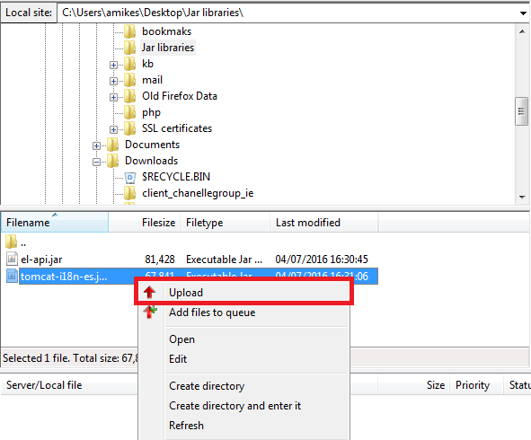
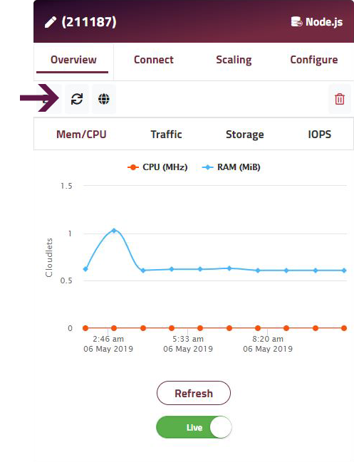

JAR library files - application dependencies - can be satisfied in two ways.

The simplest option is to just include any needed JAR libraries within your WAR file (i.e. in _WEB-INF/lib_). Consult your IDE or build tool documentation for details.

Alternatively, if you need to make a JAR library available to all apps across the application server - e.g. as recommended for database drivers - you can upload it separately by following these steps

##### Step 1

Connect to your application node via [SFTP](/access/access-via-sftp).

##### Step 2
Navigate to the _/opt/shared/lib_ folder.

!! _WEB-INF/lib_ is overwritten by each re-deployment - ensure libraries needed at this location are included within your WAR file.

##### Step 3
On your local machine navigate to the folder your JAR library is stored in, right click on it and select **Upload**.

##### Step 4

Once the file is uploaded, go back to your Enscale dashboard, enter your environment and **restart your application node**.

 