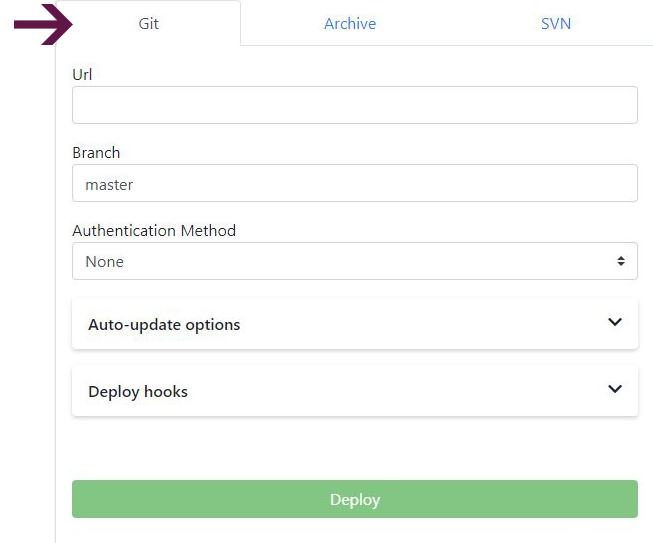

There are very few developers not using source control management. By far the most popular (at least, most frequently used) is git.

You can make your repository available anywhere on the Internet - as long as you are using git as a source control management tool, we've got you covered!

Enscale’s mission is to make life really easy for developers, so we give you the option to deploy code directly from your git repository.

### Deploy your application

##### Step 1

Log in to your Enscale dashboard and create a Node.js environment if you haven't already.

##### Step 2

Enter your environment and click **Deploy**.

##### Step 3

The default folder for all Node.js deployments is ROOT.

!!! If you already have a deployment in the ROOT folder, you need to deleted it first to be able to deploy a different project.

Select **Deploy a new project** tile.

##### Step 4

Select the **Git** tab and fill out the form.

**URL**: the URL of your git repository
**Branch**: the repository branch you wish to check out
**Authentication method**:
* **None**: use this if your git repo does not require authentication
* **Password**: select this to authenticate with username and password
* **SSH Key**: selecting this if your git repo authentication is by SSH key (e.g. GitHub deploy key). Select the key from the drop-down or add a new one. (Your key must **not** require a passphrase.)

**Auto-update**: turn this on for Enscale to check your repository regularly for updates. The frequency of checks is set by you in the auto-update interval section. If any changes are detected, Enscale will also re-deploy your application.

**Auto-resolve conflicts**: toggle on instructs Enscale to update any contradictory files ot the ones in the repository to prevent merge conflicts during re-deploy.

**Deploy hooks**: here you can enter custom scripts to run before (Pre) or after (Post) deployment. Enter the script in the appropriate tab and click **Apply** to save it.

##### Step 5

Click **Deploy**.

### Handling conflicts during updates

The recommended workflow is:
* Make changes on your local development environment.
* Commit to your git repo.
* Pull to your Enscale environment.

If you need to make any changes or additions directly to your Enscale environment (e.g. user-uploaded files), you should use a *.gitignore* to omit them from your repo.

To protect you from unexpected data loss, Enscale does not automatically force a deployment if edits / additions made to your environment result in a merge conflict.

If you find that an updated code revision is not deployed as expected, you should review the [Git logs](/environments/access/log-files#git-svn-logs) to identify and resolve the root cause of a merge conflict, then try the deploy once again.
