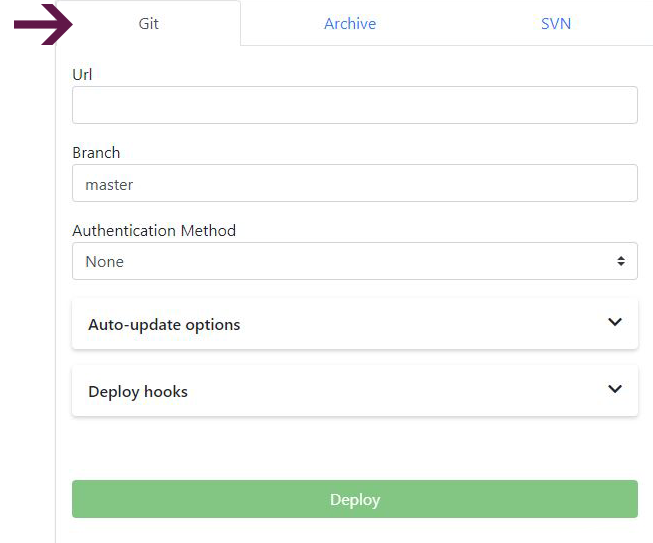

### DEPLOY FROM GIT

With Enscale, you can deploy your Ruby application directly from your git repository, so you can link your deployments with your favourite version control system.

!!! You should ensure that you have an up to date [gemfile](/ruby/deployment-guides/dependency-management) and [_rake\_deploy_](/ruby/deployment-guides/rake) file in order to make sure that your project’s gem dependencies are installed as well as all necessary commands executed by rake after deployment.

Below you can see how to deploy your application and how to set up automatic redeployments with Enscale.

### Deploy your application

##### Step 1

Create your Ruby environment with your choice of [Apache or Nginx](/servers-and-technologies#ruby) application runtime node.

##### Step 2

Enter your environment and click **Deploy** to open the Deployment Manager.

! When (re)deploying, please make sure you have an updated _rake\_deploy_ file in the application’s root folder in your git repository, containing the commands you would like rake to run after redeployment.

##### Step 3

The default context for all Ruby developments is **production**. 

In case you already deployed your project, it will show here so you don't need to upload it multiple times, just click **Select**. If your project is new, click **Deploy a new project**.

##### Step 4

Select the **GIT tab** from the drop-down menu to provide us with a link to your repository.

**URL**: the URL of your git repository

**Branch**: the repository branch you wish to checkout

**Authentication method**:

* **None**: use this if your git repo does not require authentication
* **Password**: select this to authenticate with git by username and password
* **SSH Key**: select this if your git repo authentication is by SSH key (e.g. [GitHub deploy key](https://developer.github.com/v3/guides/managing-deploy-keys/)). Select the key from the drop-down or add a new one. (Your key must **not** require a passphrase.)

**Auto-update**: turn this on for Enscale to check your repository regularly for updates. The frequency of checks is set by you in the auto-update interval section. If any changes are detected, Enscale will also re-deploy your application. 

**Auto-resolve conflicts**: toggle on instructs Enscale to update any contradictory files to the ones in the repository to prevent merge conflicts during re-deploy.

**Deploy hooks**: Here you can enter custom scripts to run before (Pre) or after (Post) deployment. Enter the script in the appropriate tab and click **Apply** to save it.

##### Step 5

Click **Deploy**.

!!! The _rake\_deploy_ file is deleted after successful execution. You can see the results of your rake tasks in the [_rake\_deploy.log_](/environments/access/log-files) file.

!!!! Now that your code is deployed, you may wish to [configure the DNS](/environments/features/add-domain-name) for your domain.

