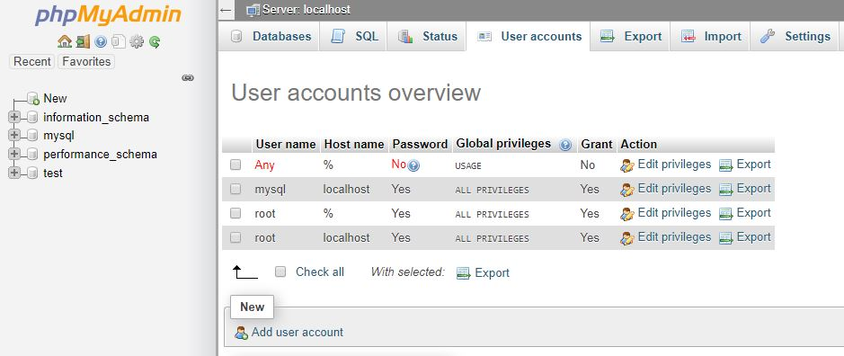
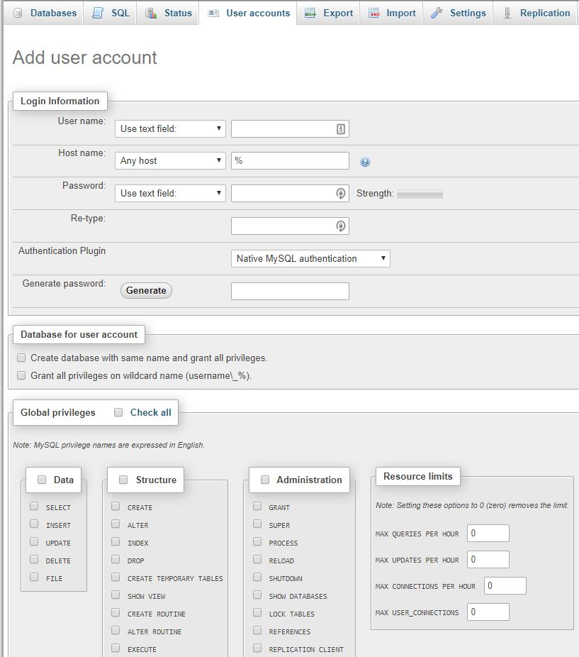

When you create your MariaDB database node, you're emailed the connection details along with your root username and password to log in to phpMyAdmin.

To connect the database to your application you should use the hostname or private IP address of your database node. They can be found in the **Connect** and **Configure** tabs respectively.

It is also recommended to set up a new user for your application with limited permissions, instead of using the default admin user. You can set one up in phpMyAdmin. 

Use the **Go to phpMyAdmin** button from the dashboard to access the admin panel and log in with the credentials you received via email.

Go to the **User accounts** tab and click **Add user account**.

Enter the login information for the new user and define the required privileges.

You can learn more about user management in phpMyAdmin from the [official documentation](https://docs.phpmyadmin.net/en/latest/privileges.html).